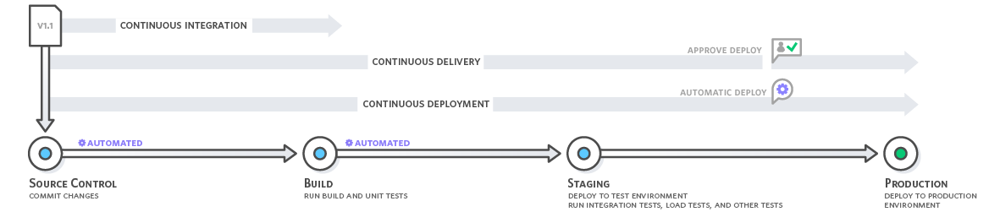

# Continuous Integration

## What is Continuous Integration?

Continuous integration is a DevOps software development practice where developers regularly merge their code changes into a central repository, after which automated builds and tests are run. Continuous integration most often refers to the build or integration stage of the software release process and entails both:

- **Automation component** (e.g. a CI or build service)
- **Cultural component** (e.g. learning to integrate frequently)

The key goals of continuous integration are to:
- Find and address bugs quicker
- Improve software quality
- Reduce the time it takes to validate and release new software updates

## Why is Continuous Integration Needed?

### Traditional Development Challenges

In the past, developers on a team might work in isolation for an extended period of time and only merge their changes to the master branch once their work was completed. This approach created several problems:

- **Difficult and time-consuming merging** of code changes
- **Bugs accumulating for long periods** without correction
- **Slower delivery of updates** to customers

These factors made it harder to deliver updates to customers quickly and efficiently.

## How does Continuous Integration Work?



### Development Workflow

With continuous integration, developers follow these practices:

1. **Frequent commits** to a shared repository using a version control system such as Git
2. **Local unit tests** may be run by developers prior to each commit as an extra verification layer before integrating
3. **Automated build and test** runs automatically on new code changes to immediately surface any errors

### CI Process Flow

Every revision that is committed triggers an automated build and test sequence:

```
Code Commit → Automated Build → Unit Tests → Results/Feedback
```

### Relationship to Continuous Delivery

- **Continuous Integration** refers to the build and unit testing stages of the software release process
- **Continuous Delivery** expands upon continuous integration by automatically building, testing, and preparing code changes for a release to production
- Continuous delivery deploys all code changes to a testing environment and/or production environment after the build stage

## Continuous Integration Benefits

### Improve Developer Productivity

Continuous integration helps your team be more productive by:
- **Freeing developers from manual tasks** through automation
- **Encouraging behaviors** that help reduce the number of errors and bugs released to customers
- **Providing immediate feedback** on code changes
- **Reducing time spent** on debugging and fixing issues later in the development cycle

### Find and Address Bugs Quicker

With more frequent testing, your team can:
- **Discover bugs earlier** in the development process
- **Address problems before they grow** into larger issues
- **Identify the exact commit** that introduced a bug
- **Reduce debugging time** with smaller, incremental changes
- **Maintain code quality** throughout the development lifecycle

### Deliver Updates Faster

Continuous integration helps your team:
- **Deliver updates to customers faster** and more frequently
- **Reduce time to market** for new features and fixes
- **Maintain a steady pace** of releases
- **Respond quickly** to customer feedback and market demands
- **Build confidence** in each release through automated testing

## Try AWS CodePipeline

AWS CodePipeline is a fully managed continuous delivery service that helps you automate your release pipelines for fast and reliable application and infrastructure updates. CodePipeline automates the build, test, and deploy phases of your release process every time there is a code change, based on the release model you define.

### Key Features of AWS CodePipeline

- **Integration with AWS services** and partner tools
- **Visual workflow** to design, view, and manage your pipeline
- **Automated testing** and approval actions
- **Flexible deployment** options
- **Built-in monitoring** and logging

### Getting Started with AWS CodePipeline

To implement continuous integration with AWS CodePipeline:

1. **Create a pipeline** in the AWS Management Console
2. **Connect your source code repository** (GitHub, CodeCommit, etc.)
3. **Configure build and test stages** using AWS CodeBuild or other build tools
4. **Set up deployment stages** for different environments
5. **Add approval actions** for manual review when needed
6. **Monitor pipeline execution** and troubleshoot issues

## Best Practices for Continuous Integration

### Commit Frequency

- **Commit small, frequent changes** rather than large, infrequent ones
- **Write meaningful commit messages** to track changes effectively
- **Run local tests** before pushing to shared repository

### Test Coverage

- **Maintain comprehensive unit tests** for all critical functionality
- **Automate testing** as much as possible
- **Include integration tests** where appropriate
- **Monitor test performance** and execution time

### Build Optimization

- **Keep builds fast** to maintain developer productivity
- **Use build caching** to reduce build times
- **Parallelize test execution** when possible
- **Monitor build success rates** and failure patterns

### Team Collaboration

- **Establish clear guidelines** for branching and merging
- **Communicate build failures** immediately to the team
- **Share responsibility** for maintaining build health
- **Document CI processes** and best practices

## Common CI Tools and Services

### AWS Services

- **AWS CodePipeline** - Continuous delivery service
- **AWS CodeBuild** - Fully managed build service
- **AWS CodeCommit** - Managed source control service

### Third-Party Tools

- **Jenkins** - Open source automation server
- **GitLab CI/CD** - Integrated CI/CD platform
- **CircleCI** - Cloud-based CI/CD platform
- **Travis CI** - Continuous integration service

## Measuring CI Success

### Key Metrics

- **Build frequency** - How often builds are triggered
- **Build success rate** - Percentage of successful builds
- **Build duration** - Time taken for builds to complete
- **Test coverage** - Percentage of code covered by tests
- **Time to detection** - How quickly bugs are found
- **Deployment frequency** - How often releases are made

### Continuous Improvement

- **Monitor metrics regularly** to identify areas for improvement
- **Gather feedback** from developers on the CI process
- **Optimize build performance** to reduce wait times
- **Expand test coverage** to improve quality
- **Automate more processes** to increase efficiency