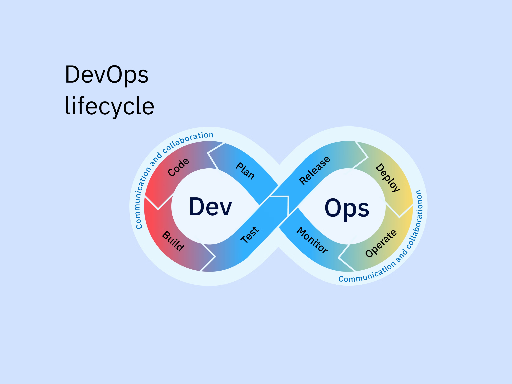
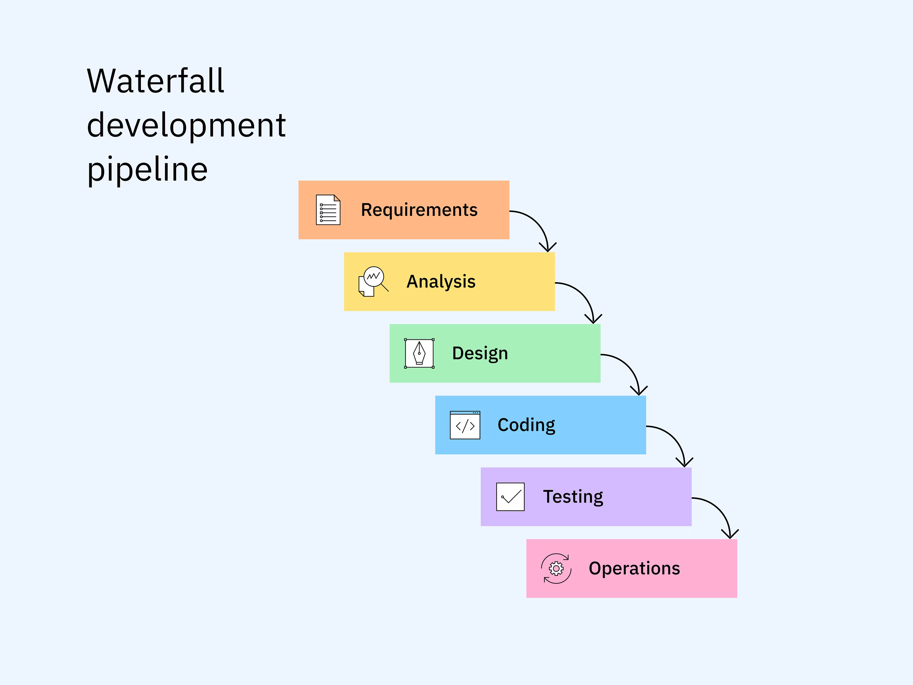
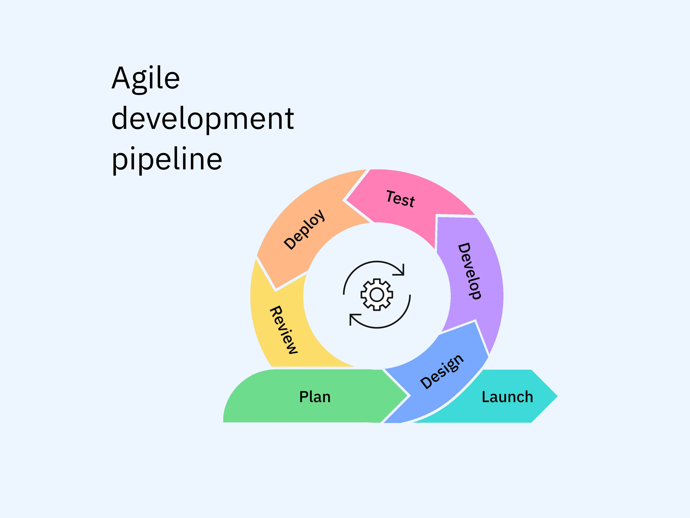
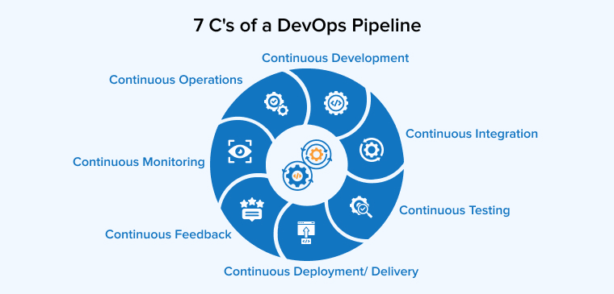

# DevOps Lifecycle

## What is the DevOps Lifecycle?

### DevOps Lifecycle Definition

The DevOps lifecycle is a continuous, iterative process for software development and deployment, consisting of eight key phases: **plan, code, build, test, release, deploy, operate and monitor**.

The DevOps process describes how software moves from ideation, through production and feedback, and back to ideation, with development and operations teams working as a single, collaborative unit. It comprises an end-to-end flow of practices and automation workflows that DevOps teams can use to plan, develop, run and optimize software releases.

### The Infinity Loop Concept

The phases of the DevOps lifecycle are often depicted as part of an "infinity loop" with:
- **Development activities on the left**: plan → code → build → test
- **Operations activities on the right**: release → deploy → operate → monitor
- **Connected in one continuous path**

#### Left Side of the Loop (Development)
On the "plan → code → build → test" side of the loop, teams:
- Refine software requirements into small user stories
- Commit code to code repositories incrementally (but frequently)
- Use continuous integration (CI) tools to automatically build and test every code change

#### Right Side of the Loop (Operations)
On the "release → deploy → operate → monitor" side:
- Automation workflows push changes through IT environments and out to users
- Observability tools track system health, software performance and user behavior
- Teams detect issues and measure overall impact

### Continuous Improvement Philosophy

The infinity loop emphasizes that:
- Each phase of the DevOps lifecycle influences the others
- Teams share work, knowledge and responsibilities instead of passing them between silos
- DevOps workflows streamline software delivery and optimization processes
- Every cycle should be faster, safer and more automated than the last

As such, the DevOps lifecycle enables enterprises to align people, processes and tools to deliver high-quality software applications and frictionless user experiences.

## Phases of the DevOps Lifecycle

Every phase of the DevOps lifecycle informs and overlaps with the other phases, but each one has a clear purpose and a set of associated activities.

### 1. Plan

In the planning phase, DevOps teams translate business needs and user feedback into clear, prioritized, time-bound work plans and project management workflows that guide development and operations activities in subsequent phases. This phase clarifies the vision, scope and roadmap for a software release or system build.

#### Typical Planning Activities
- **Refining and triaging product backlogs** (new features, bug fixes, technical debt)
- **Analyzing stakeholder input** to capture user needs and constraints
- **Breaking work into tasks, user stories and epics** to estimate resource requirements and identify dependencies
  - **User stories**: Software feature descriptions written from the user's perspective
  - **Epics**: User stories too expansive to address in a single software iteration
- **Defining success metrics**: KPIs, service level indicators (SLIs) and service level objectives

### 2. Code

During the coding phase, developers turn planned infrastructure and software requirements into working source code with an eye toward quality assurance and future operations. It's not just about writing new code—it's also about setting up components for automated build, test, integration and deployment processes.

#### Coding Process Activities
- **Writing code** to implement new functionality, fix defects and address non-functional needs (security, performance)
- **Committing small, incremental code changes** to shared repositories within version control systems (Git, GitHub)
- **Testing code commits** so they can be seamlessly built and integrated with the codebase
- **Adding or updating automated unit and component tests** for future CI runs to automatically validate code behavior

### 3. Build

In the building phase, source code changes are automatically compiled, validated and packaged into deployable build artifacts. DevOps tools fetch code changes from the version control system, run automated checks and produce packages (Docker container images, compiled binaries) that are versioned and ready for deployment.

#### Build Process
- **Automated scripts and build tools** compile the source code, resolve and download dependencies (libraries, frameworks, modules) and link everything into an executable or image
- **Basic automated tests** run as part of the build
  - If the build fails, it's marked as broken and remains in the build phase
  - If the build passes, it's advanced to the next phase of the lifecycle

### 4. Test

The testing phase—also called validation—aims to ensure that a code change behaves as expected in real-world conditions. DevOps teams use advanced testing tools to continuously validate that each change is functional, secure and performant before it moves further down the pipeline or reaches production.

#### Testing Integration
- **Tightly integrated into CI/CD pipeline** for fast, frequent feedback on code quality
- **Primary objective**: Identify defects as early as possible (when they're cheaper and easier to fix)
- **Prevention**: Stop faulty builds from progressing toward release
- **Verification**: Ensure new changes won't break existing functionality, maintaining system stability

### 5. Release

The release phase provides a controlled gateway between "tested build" and "live deployment," wherein code changes are approved for production and made visible to target users. Development teams prepare proven, tested code for deployment by packaging it, validating that it's production-ready and coordinating how and when it will move into staging and production environments.

#### Common Release Processes
- **Final quality, security and compliance checks** against predefined acceptance criteria
- **Attaching build artifacts** to specific release versions and creating change logs and documentation
- **Identifying vulnerabilities** in the upcoming release and planning mitigation strategies (rollbacks)

### 6. Deploy

During the deployment phase, tested and packaged code is automatically delivered to the target environments (staging or production). Configuration management and infrastructure as code (IaC) tools help DevOps teams ensure that software is delivered in a reliable, repeatable way.

#### Deployment Technologies
- **Continuous delivery (CD) and containerization platforms** (Kubernetes) orchestrate software deployment processes
- **Configuration management and IaC tools** use configuration files and high-level descriptive coding languages to automate infrastructure provisioning and orchestration

#### Deployment Strategies

##### Blue-Green Deployment
- Apps are deployed in two parallel production environments
- **Blue environment**: Runs the live application
- **Green environment**: Handles testing and validation for new app versions
- When the new iteration passes, the green environment becomes live, and blue remains idle for rollbacks

##### Canary Deployments
- Teams deploy applications to a small subset of users ("canaries") for live-environment monitoring
- Much like canaries warned coal miners of toxic gases, canary deployments warn development teams of app defects
- If the application performs well with the canary group, developers progressively roll it out to larger groups

### 7. Operate

The operation phase focuses on keeping live systems stable, performant, secure and available for real users under real workloads. It's not the "end" of the application lifecycle—rather, it feeds data and insights back into earlier stages.

#### Operational Activities
- **Run and supervise applications** in the production environment, including infrastructure, services and dependencies
- **Manage capacity planning and scaling** processes so traffic flows don't degrade over time
- **Detect and triage issues**, address performance bottlenecks and apply bug fixes or rollbacks
- **Apply security patches** and enforce governance practices (access controls, compliance audits)

### 8. Monitor

In the monitoring phase, teams continuously observe applications and infrastructure in production to detect issues, understand real user behavior and send insights back into development and operations.

#### Monitoring Process
- **Collect observability data** (metrics, logs and traces) from apps, servers, networks and databases
- **Track performance in real time** and set thresholds and alerts
- **Anomalies** (high API latency, suspicious access patterns) trigger notifications for rapid investigation
- **Feedback loop**: Issues found are forwarded to issue trackers and backlogs for subsequent iterations

## DevSecOps: The "Ninth Phase"

The infinity loop doesn't explicitly include a "secure" phase, but DevOps pipelines often incorporate security measures throughout the lifecycle. This is where DevSecOps enters the framework.

### DevSecOps Definition

DevSecOps—short for development, security and operations—is a software development practice that shifts security protocols from the right (end) to the left (beginning) of the development lifecycle.

### Shift-Left Security
With shift-left, developers implement security protocols as they write code:
- **Data encryption**
- **Input validation**
- **Role-based access controls**
- **Multifactor authentication**

### Shift-Right Security
Shift-right activities extend security practices into post-deployment production environments:
- **Monitoring** applications at runtime under real-world conditions
- **Testing** in production conditions
- **Protecting** applications during live operation

### Combined Security Strategy
Used together, shift-left and shift-right security enable enterprises to integrate security controls into every phase of the DevOps lifecycle. This "shift-everywhere" security strategy helps implement both early prevention and post-deployment threat detection and response.

## DevOps vs. Waterfall vs. Agile

### Waterfall

- **Linear, sequential process** where each phase must be fully completed before the next begins
- **Prioritizes**: Proactive planning, detailed documentation, predictability
- **Suitable for**: Projects with stable, well-defined requirements (government, healthcare)
- **Limitations**: Development teams are siloed; making changes after a phase is costly and time-consuming; struggles with agility

### Agile

- **Iterative development** delivering small, functional increments through short cycles ("sprints")
- **Prioritizes**: Adaptive planning, early delivery, continuous improvement based on stakeholder feedback
- **Effective for**: Dynamic environments (startups)
- **Limitations**: Focuses on software development process, excluding operations processes

### DevOps
- **Modern cultural and technical practice** that integrates development and operations teams
- **Leverages**: CI/CD tools for testing, deployment and monitoring automation
- **Advantages**: Accelerates software releases, builds performant applications in dynamic microservices architectures and cloud-based IT environments

## The 7 C's (Continuous Processes) of the DevOps Lifecycle

The 7 C's provide another way to conceptualize the DevOps lifecycle as the product of seven continuous processes.

### 1. Continuous Development
- Involves planning and coding software
- Developers break the process into smaller, manageable iterations
- Changes stored in version control systems
- Continuously align code with stakeholder requirements
- Helps minimize risk and quickly adapt to changes

### 2. Continuous Integration
- Merges code changes from multiple developers into a shared repository
- Automatically triggers builds after every commit
- Enables teams to continuously improve software applications
- Provides consistent feedback
- Catches and fixes errors before they affect software performance
- Delivers higher-quality software on predictable schedules

### 3. Continuous Testing
- Enables developers to automatically initiate code reviews and testing protocols (unit tests)
- Uses testing tools to continuously examine integrated code for bugs, usability flaws and performance problems
- Gives developers rapid feedback to improve software without delaying the lifecycle

### 4. Continuous Delivery and Deployment
- **Continuous delivery**: Automates delivery of applications and validated code changes to all necessary infrastructure environments for further testing
- **Continuous deployment**: Takes delivery a step further by automatically deploying every approved change to production without human intervention
- Code builds that pass all tests are packaged and delivered to code repositories in a deployable state

### 5. Continuous Feedback
- Requires DevOps teams to glean insights from monitoring data, user experience data and stakeholders' input
- Refines the product backlog and determines the urgency of each improvement
- Creates a continuous improvement loop

### 6. Continuous Monitoring
- Tracks application and infrastructure performance in real time
- Identifies issues proactively to maintain system reliability
- Most monitoring tools visualize CI/CD pipeline data using dashboards
- Increases tech stack visibility and enables data-driven optimizations

### 7. Continuous Operations
- Automation tools handle infrastructure provisioning, resource scaling, data backups, traffic routing and system maintenance
- Enables DevOps teams to continuously apply feedback to new app iterations
- Ensures operational excellence through automation

## Benefits of the DevOps Lifecycle

### Better Software Quality
- DevOps lifecycles prioritize continuous code and software testing
- Bugs and vulnerabilities are caught early in the development process
- Developers deliver higher-quality code

### Faster Time-to-Market
- DevOps processes accelerate software development cycles
- Reduces lead time between code integration and software delivery from weeks to minutes

### Less Risk and Downtime
- Small, frequent code updates make bugs and errors easier to resolve
- Prevents large-scale outages
- Reduces mean time to repair (MTTR)

### Greater Transparency
- Observability dashboards and continuous feedback loops ensure every DevOps team member has access to all necessary information
- Improves transparency and accountability across the enterprise

### Increased Productivity
- DevOps culture automates repetitive, manual steps (troubleshooting builds, managing deployment scripts)
- Teams can focus on optimizing applications for end users
- Enables focus on innovation rather than maintenance

## Implementing the DevOps Lifecycle

### Key Success Factors
- **Cultural transformation**: Break down silos between development and operations
- **Automation investment**: Tools and processes for each lifecycle phase
- **Continuous improvement**: Regularly refine and optimize processes
- **Measurement and monitoring**: Track metrics to guide improvements
- **Security integration**: Incorporate security throughout the lifecycle

### Tools and Technologies
- **Version control**: Git, GitHub, GitLab
- **CI/CD pipelines**: Jenkins, AWS CodePipeline, GitLab CI
- **Containerization**: Docker, Kubernetes
- **Infrastructure as code**: AWS CloudFormation, Terraform
- **Monitoring**: AWS CloudWatch, Prometheus, Grafana
- **Security**: AWS Security Hub, vulnerability scanners

### Best Practices
- **Start small**: Begin with pilot projects and expand gradually
- **Automate everything**: Manual processes slow down the lifecycle
- **Fail fast**: Detect issues early and recover quickly
- **Measure everything**: Use data to drive decisions
- **Collaborate continuously**: Communication is key to success