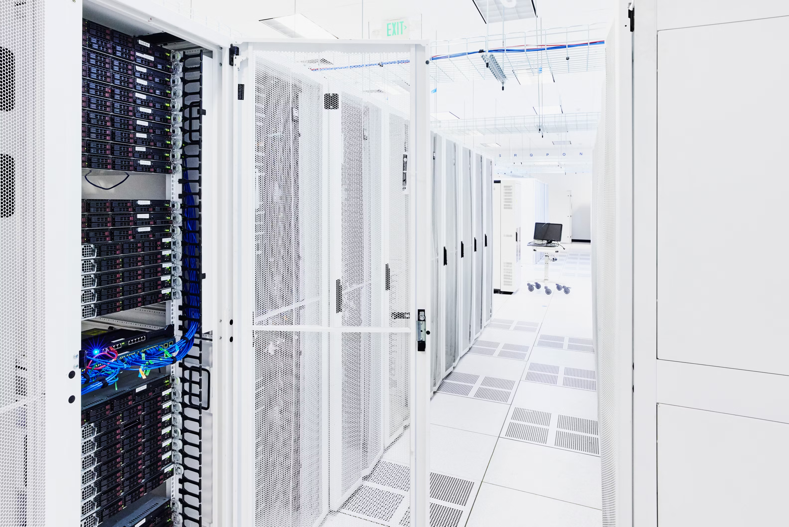

# Virtual Machines (VMs) 

## What is a Virtual Machine?

A **virtual machine (VM)** is a virtual representation or emulation of a physical computer that uses software instead of hardware to run programs and deploy applications.

### Key Characteristics:
- **Resource Sharing**: Uses resources of a single physical machine (memory, CPU, network interface, storage)
- **Multiple Operating Systems**: Enables businesses to run multiple machines virtually with different operating systems on a single device
- **Host-Guest Architecture**: VMs are referred to as "guests" running on a physical "host" machine
- **Alternative Names**: Also known as virtual servers, virtual server instances (VSIs), and virtual private servers (VPSs)

### Market Growth:
- Global VM market: USD 11.11 billion in 2024
- Projected growth: USD 43.81 billion by 2034 (CAGR of 14.71% from 2025-2034)
- AI integration driving demand with AI market reaching USD 826.70 billion by 2030

## What is Virtualization?

**Virtualization** is the process of creating software-based or virtual versions of resources (compute, storage, networking, servers) or applications.

### Core Components:
- **Hypervisor (VMM)**: Lightweight software layer that manages virtual machines running alongside each other
- **Software-Defined Networking (SDN)**: Enables dynamic allocation of network resources to VMs
- **Foundation for Cloud Computing**: Virtualization allows more efficient use of physical computer hardware

## Origins of Virtualization and VMs

### Historical Timeline:
- **1964**: IBM introduces CP-40, experimental time-sharing research project for IBM System/360
- **1972**: IBM releases VM/370, considered the first virtual machine, along with System/370 mainframes
- **1998**: VMware develops x86 operating system, enabling single machine segmentation into multiple VMs
- **1999**: VMware launches VM Workstation 1.0, first commercial product for multiple OS VMs on single PC
- **Present**: Virtualization is standard practice for enterprise IT infrastructure

## How Virtual Machines Work

### Hypervisor Technology:
Virtualization relies on hypervisor technology, a software layer placed on physical computers that separates OS and applications from hardware.

### Types of Hypervisors:

#### Type 1 Hypervisors (Bare Metal)
- Run directly on physical hardware, replacing the OS
- Used in enterprise environments
- Examples: VMware vSphere, Kernel-based Virtual Machine (KVM)
- Features: Separate management tools, VM templates for different purposes

#### Type 2 Hypervisors (Hosted)
- Run as applications within a host OS
- Target single-user desktop/notebook platforms
- Manual VM creation and resource allocation
- Examples: VMware Workstation Pro, Oracle VirtualBox

## System Virtual Machines vs. Process Virtual Machines

### System Virtual Machines (Full Virtualization)
- Share underlying physical machine resources between different VMs
- Each VM runs its own complete operating system
- Provide complete hardware virtualization

### Process Virtual Machines (Application Virtual Machines)
- Run an application inside an OS and support a single process
- Examples: Java Virtual Machines (JVMs)
- Translate application-level instructions to run directly on hardware
- Don't emulate entire OS or rely on hypervisor

## Advantages of Virtual Machines

### 1. Resource Usage and Improved ROI
- Multiple VMs on single physical computer reduce hardware costs
- Higher return on existing hardware investments
- Significant reduction in IT capital and operating expenses

### 2. Agility and Speed
- Easy to spin up new VMs quickly
- Faster scaling to meet new workload demands
- Reduced downtime compared to provisioning new hardware
- Load balancing optimizes performance across VMs

### 3. Portability
- Relocate VMs among physical systems in a network
- Move between on-premises and cloud environments
- Useful for hybrid cloud scenarios

### 4. Flexibility
- Faster and easier than installing OS on physical server
- Clone VMs with pre-installed OS
- Create environments on demand for development and testing

### 5. Security
- Scan VM files for malicious software externally
- Create snapshots and restore to previous states
- Quick deletion and recreation of compromised VMs
- Isolation prevents malware spread between VMs

### 6. Sustainability
- Fewer physical servers reduce energy consumption
- Improved environmental impact
- Lower cooling requirements in data centers

## Disadvantages of Virtual Machines

### 1. Performance Issues
- VMs depend on hardware resources from physical host
- Limited resources can lead to reduced performance
- Resource contention between multiple VMs

### 2. Increased Complexity
- Complex to configure and manage
- Requires technical knowledge and expertise
- Additional layer of infrastructure to maintain

### 3. Single Point of Failure (SPOF)
- Reliance on one physical computer creates failure risk
- Host machine failure affects all guest VMs
- Requires robust backup and disaster recovery planning

## Top Virtual Machine Use Cases

### Enterprise and Cloud Computing:
1. **Enable Cloud-Based Computing**: Fundamental unit of cloud computing in hyperscale environments (AWS, IBM Cloud, Azure, Google Cloud)
2. **Speed Workload Migration**: Portability helps migration from on-premises to cloud
3. **Accelerate Hybrid Cloud Journeys**: Infrastructure for blending on-premises, private cloud, and public cloud
4. **Support DevOps**: Configure VM templates for development and testing processes
5. **Support Disaster Recovery**: Easy provisioning and deployment for rapid recovery

### Development and Testing:
6. **Test New Operating Systems**: Test-drive systems without affecting primary OS
7. **Investigate Malware**: Fresh machines for testing malicious programs
8. **Run Incompatible Software**: Use programs only available in different OS

### Security and Research:
9. **Browse Securely**: Visit sites without infection risk using snapshots
10. **Build and Use Cyber Ranges**: Simulated environments for cybersecurity training
11. **Enhance AI Workloads**: Scalable, isolated environments for model training and deployment

## Common Types of Virtual Machines

### VMware Virtual Machines
- Leader in virtualization market
- First to commercialize x86 virtualization
- Provides both Type 1 and Type 2 hypervisors

### Windows Virtual Machines
- Supported by most hypervisors
- Microsoft Hyper-V comes with Windows OS
- Parent/child partition architecture

### Android Virtual Machines
- ARM vs. x86 architecture challenges
- Solutions: Shashlik, Genymotion (emulators), Android-x86 (port), Anbox (kernel-based)
- Essential for Android development and testing

### Mac Virtual Machines
- Apple restricts macOS to Apple hardware
- Can create macOS guests on Mac hardware using Type 2 hypervisors

### iOS Virtual Machines
- Impossible to run iOS in VM due to Apple restrictions
- Alternative: iPhone simulator in Xcode IDE

### Java Virtual Machines (JVM)
- Execution environment for Java programs
- "Write once, run anywhere" capability
- Compiles to bytecode, then translates to machine code
- Platform-specific machine code generation

### Python Virtual Machines
- Similar to JVM concept
- Translates Python programs to bytecode
- Executes bytecode via Python VM
- Cross-platform compatibility

### Linux Virtual Machines
- Common as both guest and host OS
- KVM (Kernel-based Virtual Machine) as native hypervisor
- Maintained primarily by Red Hat

### Ubuntu Virtual Machines
- Canonical's Linux distribution
- Available in desktop and server versions
- Enhanced integration with Windows Hyper-V
- Support for clipboard, dynamic resizing, shared folders

## Multitenant vs. Single-Tenant

### Multitenant VMs
- Multiple users share common physical infrastructure
- Most cost-effective and scalable approach
- Lacks some isolation characteristics
- Suitable for general workloads

### Single-Tenant VMs

#### Dedicated Host
- Rent entire physical machine
- Maximum hardware flexibility and transparency
- Workload control and placement advantages
- Benefits for bring-your-own license software

#### Dedicated Instance
- Single-tenant isolation without specific physical machine coupling
- Control over workload placement
- May move to different physical machines after reboot
- Physical location may change

## Pricing Models for VMs

### 1. Pay-as-You-Go
- No upfront costs
- Pay by hour or second
- Flexible usage-based billing
- Suitable for variable workloads

### 2. Transient/Spot Instances
- Lowest-cost model
- Uses provider's excess capacity
- Capacity can be reclaimed at any time
- Ideal for non-critical, interruptible workloads

### 3. Reserved Instances
- Explicit term commitment (1-3 years)
- Steep discounts compared to pay-as-you-go
- Predictable pricing for long-term workloads
- Suitable for stable, continuous applications

### 4. Dedicated Hosts
- Pay total cost of physical server
- Billed hourly or monthly
- Complete control over hardware
- Maximum isolation and compliance

## Virtual Machines vs. Bare Metal Servers

### Bare Metal Servers
- **Characteristics**: Raw hardware, power, isolation
- **Architecture**: Single-tenant, physical servers without hypervisor
- **Best For**: High-performance, data-intensive applications
- **Use Cases**: ERP, CRM, SCM, ecommerce, financial services
- **Advantages**: Maximum performance, complete isolation, regulatory compliance

### Virtual Machines
- **Characteristics**: Flexibility, scalability, resource sharing
- **Architecture**: Hypervisor on bare metal hardware
- **Best For**: Dynamic workloads, resource optimization
- **Use Cases**: Development/testing, web applications, microservices
- **Advantages**: Server capacity increase, easy migration, workload division

## Virtual Machines vs. Containers

### Virtual Machines
- **Virtualization**: Hardware level via hypervisor
- **Components**: Guest OS + virtual hardware + application + libraries
- **Size**: Heavyweight (GBs)
- **Startup**: Slow (minutes)
- **Isolation**: Strong (complete OS isolation)

### Containers
- **Virtualization**: Operating system level
- **Components**: Application + libraries/dependencies only
- **Size**: Lightweight (MBs)
- **Startup**: Fast (seconds)
- **Isolation**: Process-level isolation

### Coexistence Scenarios
- **Containers in VMs**: Common in enterprises with VM-based infrastructure
- **VMs for databases**: Tighter security with resource isolation
- **Containers for front-end**: Portability and speed for customer-facing apps

## 10 Things to Consider When Choosing a VM Provider

### 1. Reliable Support
- 24x7 customer support (phone, email, chat)
- Real person assistance for critical IT situations
- Additional hands-on backing services

### 2. Managed Options
- Both unmanaged and managed solutions
- Provider responsibility for setup and maintenance
- Ongoing performance monitoring services

### 3. Software Integration
- Compatibility with operating systems and third-party software
- Strong partnerships with major software suppliers
- Open-source technology support

### 4. High-Quality Network and Infrastructure
- Modern data centers and bare metal servers
- High-speed networking technology
- State-of-the-art hardware

### 5. Location
- Proximity to users for reduced latency
- Global network of data centers and POP locations
- Data placement where and when needed

### 6. Backup and Recovery
- Plans for unexpected events
- Add-on backup and redundancy options
- Continuous operation capabilities

### 7. Scalability and Ease
- Fast and easy VM management (spin up, spin down, reserve, pause, update)
- On-demand scalability
- User-friendly management interfaces

### 8. Varied CPU Configurations
- Multiple configuration packages
- Options for single and multitenant requirements
- Workload-specific configurations

### 9. Security Layers
- Private network lines
- Federal data center options
- Built-in encryption features
- Regulatory compliance standards

### 10. Seamless Migration Support
- Transition between on-premises and off-premises
- Complete data ingest options
- Over-the-network and application-led migration

---

**Authors**: Stephanie Susnjara (Staff Writer, IBM Think), Ian Smalley (Staff Editor, IBM Think)

**Sources**: IBM Think, Precedence Research, various cloud provider documentation