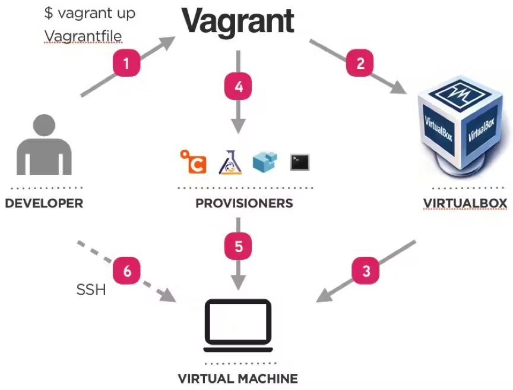

# Vagrant Overview

---

## 1. What is Vagrant?

Vagrant is a **HashiCorp tool** for building and managing virtual machine environments in a single, automated workflow. It lowers development environment setup time, increases development/production parity, and eliminates the classic "it works on my machine" problem.

Vagrant bridges the gap between:
- **Host machine** — your local computer
- **Guest machine** — the virtual environment

It uses configuration files called **Vagrantfiles** to automate setup and configuration, letting teams focus on development rather than environment management.

### Why Vagrant?

Vagrant provides easy-to-configure, reproducible, and portable work environments built on industry-standard technology, controlled by a **single consistent workflow**.

Vagrant stands on the shoulders of giants — machines are provisioned on top of VirtualBox, VMware, AWS, or other providers, and industry-standard tools like shell scripts, Chef, or Puppet handle software installation.

### Who Benefits?

**For Developers**
Vagrant isolates dependencies and their configuration in a single disposable, consistent environment — without sacrificing editors, browsers, or debuggers. A single `Vagrantfile` lets the whole team spin up identical environments regardless of whether they're on Linux, macOS, or Windows.

**For Operators / DevOps Engineers**
Vagrant provides a disposable environment and consistent workflow for developing and testing infrastructure scripts (shell, Chef, Puppet, etc.) — locally with VirtualBox/VMware, or remotely on AWS/RackSpace, using the same workflow.

**For Designers**
Once a developer configures Vagrant, designers can `vagrant up` and immediately have the full app environment running — no more asking for help with environment setup.

**For Everyone**
Vagrant is designed as the easiest and fastest way to create a virtualized environment.

---

## 2. How Does Vagrant Work?

Vagrant acts as an **orchestration layer** sitting between the developer and the underlying virtualization technology. It manages environments using providers (like VirtualBox or VMware), and configures those environments using provisioners (like shell scripts, Ansible, or Chef).

> *"Vagrant manages the environments, and uses, for example, VirtualBox to provide (launch) the machines."*

Environments managed by Vagrant can run on:
- **Local virtualized platforms** — VirtualBox, VMware
- **Cloud providers** — AWS, OpenStack
- **Containers** — Docker

The diagram below illustrates the full Vagrant workflow:



### Step-by-Step Breakdown

**Step 1 — Developer writes and runs the Vagrantfile**
The developer creates a `Vagrantfile` — a declarative Ruby-syntax file that describes the type of machine needed, plus how to configure and provision it. Running `vagrant up` executes this file.

**Step 2 — Vagrant communicates with the Provider**
Vagrant instructs the provider (e.g., VirtualBox) to create and launch the virtual machine. Vagrant abstracts provider differences so the same `Vagrantfile` works across VirtualBox, VMware, AWS, etc.

**Step 3 — The machine is brought up**
The provider launches the virtual machine based on the box (base image) specified in the Vagrantfile.

**Step 4 — Vagrant invokes a Provisioner**
Once the machine is running, Vagrant calls the configured provisioner(s) to install software and configure the environment.

**Step 5 — The Provisioner configures the machine**
Provisioners run their scripts or playbooks inside the VM. This could be a simple shell script, or a full configuration management tool like **Ansible**, **Chef**, or **Puppet**. Provisioners handle:
- Installing dependencies
- Automation
- Configuration management
- Orchestration

**Step 6 — Developer accesses the machine via SSH**
Once provisioned, the developer connects to the running VM using `vagrant ssh` — no manual SSH key configuration needed.

### The Bigger Picture

Vagrant is essentially a **wrapper and workflow tool**. It doesn't do the virtualization itself — it coordinates between:

| Layer | Role | Examples |
|---|---|---|
| **Vagrant** | Orchestration & workflow | `vagrant up`, Vagrantfile |
| **Provider** | Launches the machine | VirtualBox, VMware, AWS, Docker |
| **Provisioner** | Configures the machine | Shell, Ansible, Chef, Puppet, Terraform |

This separation of concerns is what makes Vagrant so powerful — you can swap providers or provisioners independently, while the developer-facing workflow stays exactly the same.

### Key terms

To understand Vagrant properly, first of all we must understand properly certain terms i.e. Virtual Machine, Virtual Box and Provisioning.

**Virtual Machine:** It’s a separate part of the main computer that believes to be itself as a computer. Let’s understand this with example.
Suppose, we have a CPU with 3 core processor, 8GB RAM, 500 GB hard drive space then from this we can easily convert 1 core, 2 GBRAM and nearly about 20GB hard drive space into VM.

Once this much space is transformed into a VM then it considers itself as a computer and becomes unaware of the parent system. This means by transforming some part of memory into a Virtual machine, you are actually creating a computer inside a computer.

This means in case your system is caught by a virus then only this VM will be affected, the computer will remain safe. Yes, creating a VM will slow down your computer but once you shut it down then the memory is freed from it.

Remember you are not shutting down your main PC only the VM. VM is developed for a specific purpose and once that purpose is achieved, it can be physically shut down. In order to create this VM, there’s a need to develop Virtual Box and this is as follows:

**Virtual Box:** With this virtual box, one can easily and quickly create virtual machines. It provides easy to use graphical interface that is used to configure several virtual machines and it helps you to choose the amount of your computer memory that you wish to transform into virtual machine.
For this, one needs an existing image, let’s say an installation CD. If you wish to create a VM for Windows then you must keep Windows installation DVD handy.

**Provisioning:** Once VM is developed, then it’s time to configure it in the same way we are doing in a new computer. This task is time consuming. Provisioning is a way to reduce the time taken in this task.
After creating the VM, launch the provisioner and then everything will be done on its own.
So, now comes the time to know about Vagrant. Vagrant integrates Provisioner and virtual box to configure VM. Vagrant machines don’t contain any graphical elements, windows or taskbars.
---

## 3. Getting Started

### Standard Vagrant Workflow

1. **Scope** — Identify requirements: OS, tools, dependencies
2. **Author** — Write the `Vagrantfile` to specify the environment
3. **Manage** — Use Vagrant commands to start, stop, and destroy environments
4. **Share** — Distribute the `Vagrantfile` or packaged box for consistent team setups

### Installation

Vagrant is distributed as a **binary package** by HashiCorp, or can be installed via popular package managers.

**Steps:**
1. Download the pre-compiled binary for your system
2. Unzip the archive — the `vagrant` binary is a single file
3. Add it to your `PATH`

**Verify installation:**
```bash
vagrant --help
vagrant --version
```

### Setting Up Your First Environment

**Prerequisites:** Vagrant CLI + VirtualBox (or another provider)

```bash
# Create and enter project directory
mkdir learn-vagrant-get-started
cd learn-vagrant-get-started

# Initialize with a box
vagrant init hashicorp-education/ubuntu-24-04 --box-version 0.1.0

# Start the VM
vagrant up

# SSH into the VM
vagrant ssh

# Exit the VM
logout
```

The generated `Vagrantfile` looks like:
```ruby
Vagrant.configure("2") do |config|
  config.vm.box = "hashicorp-education/ubuntu-24-04"
  config.vm.box_version = "0.1.0"
end
```

### VM Lifecycle Commands

| Command | Description |
|---|---|
| `vagrant up` | Create and start the VM |
| `vagrant ssh` | Connect via SSH |
| `vagrant suspend` | Pause the VM (saves memory state) |
| `vagrant resume` | Restore a suspended VM |
| `vagrant halt` | Graceful shutdown |
| `vagrant destroy` | Delete the VM entirely |
| `vagrant reload` | Restart and reload Vagrantfile config |
| `vagrant provision` | Re-run provisioning scripts |
| `vagrant status` | Show VM status |

> **Note:** `vagrant destroy` does NOT remove the downloaded box file. Use `vagrant box remove <name>` to remove it.

---

## 4. Fundamentals

### Vagrant Boxes

Boxes are the **package format** for Vagrant environments. Instead of building a VM from scratch, Vagrant clones a base image (box) to quickly spin up a machine.

- Boxes are specified in the `Vagrantfile`
- Boxes are stored globally per user and reused across projects
- Modifying files in one VM does **not** affect another VM using the same box
- Box names follow the format: `username/box-name` (e.g., `hashicorp/bionic64`)

**Finding Boxes:**
Browse the public catalog at **HCP Vagrant Registry** ([vagrantcloud.com](https://portal.cloud.hashicorp.com/vagrant/discover)) for pre-built boxes covering most major OS and common stacks (LAMP, Ruby, Python, etc.).

**Official Recommended Boxes:**
- `hashicorp/bionic64` — Ubuntu 18.04 64-bit, supports VirtualBox, Hyper-V, VMware
- **Bento boxes** — open source, supports VMware, VirtualBox, Parallels

```bash
vagrant init hashicorp/bionic64
```

Or in an existing Vagrantfile:
```ruby
config.vm.box = "hashicorp/bionic64"
```

**Managing boxes:**
```bash
vagrant box remove hashicorp-education/ubuntu-24-04
```

### The Vagrantfile

The `Vagrantfile` is the **central blueprint** of a Vagrant environment. It describes:
- The type and operating system of the machine
- Software to install (provisioning)
- Network configuration
- Shared folder settings
- Multi-machine setup

**Key facts:**
- One Vagrantfile per project
- Should be **committed to version control**
- Written in **Ruby syntax** (no Ruby knowledge required — mostly variable assignment)
- Filename is literally `Vagrantfile` (case-insensitive)

**Lookup Path:** When any `vagrant` command is run, Vagrant climbs up the directory tree searching for the first Vagrantfile it finds. Example search order from `/home/user/projects/foo`:
```
/home/user/projects/foo/Vagrantfile
/home/user/projects/Vagrantfile
/home/user/Vagrantfile
/home/Vagrantfile
/Vagrantfile
```

You can override the search root with the `VAGRANT_CWD` environment variable.

**Vagrantfile Load Order (highest specificity wins):**
1. Vagrantfile packaged with the box
2. Vagrantfile in `~/.vagrant.d` (user-level defaults)
3. Vagrantfile in the project directory *(this is the one you edit most)*
4. Multi-machine overrides
5. Provider-specific overrides

### Provisioning

Provisioning automates software installation and configuration when a VM is created.

**Example Vagrantfile with provisioning:**
```ruby
Vagrant.configure("2") do |config|
  config.vm.box = "hashicorp-education/ubuntu-24-04"
  config.vm.box_version = "0.1.0"

  # Run a shell script
  config.vm.provision "shell", name: "install-dependencies", path: "install-dependencies.sh"

  # Inline shell provisioner
  config.vm.provision "shell", name: "start-app", inline: <<-SHELL
    cd /home/vagrant/myapp
    docker compose up -d
  SHELL

  # run: "never" means only run when explicitly targeted
  config.vm.provision "shell", name: "reload-app", run: "never", inline: <<-SHELL
    /usr/local/bin/reload-app
  SHELL
end
```

**Running provisioners:**
```bash
vagrant up                                      # Runs provisioners on first up
vagrant provision                               # Re-run all provisioners
vagrant up --provision                          # Force provisioning on start
vagrant provision --provision-with reload-app   # Run a specific provisioner
```

> **Best practice:** Make provisioning scripts **idempotent** — they should run multiple times without causing errors or inconsistencies.

Vagrant also integrates with **Ansible, Chef, and Puppet** for more complex provisioning workflows.

---

## 5. Important Concepts

### Synced Folders

Synced folders allow Vagrant to share a directory on the **host machine** with the **guest machine**, enabling local development while using guest machine resources to run the project.

By default, Vagrant shares the **project directory** (where the Vagrantfile lives) to `/vagrant` inside the guest.

**Configuration:**
```ruby
Vagrant.configure("2") do |config|
  config.vm.synced_folder "src/", "/srv/website"
end
```

- First parameter: path on the **host** (relative to project root)
- Second parameter: absolute path on the **guest** (created if it doesn't exist)

**Common Options:**

| Option | Type | Description |
|---|---|---|
| `create` | boolean | Create host path if it doesn't exist (default: false) |
| `disabled` | boolean | Disable this synced folder |
| `owner` | string | User who owns the folder (default: SSH user) |
| `group` | string | Group that owns the folder |
| `type` | string | Synced folder type (e.g., "nfs") |
| `mount_options` | array | Additional mount options |

**Disabling a synced folder:**
```ruby
config.vm.synced_folder "src/", "/srv/website", disabled: true
# Disable the default /vagrant share:
config.vm.synced_folder ".", "/vagrant", disabled: true
```

**Key behavior:**
- Synced folders are set up automatically on `vagrant up` and `vagrant reload`
- The relationship is **bidirectional** — changes on either side are mirrored
- If you destroy the VM, the **local directory remains untouched**
- When you recreate the VM, Vagrant immediately mounts the synced folder

### Networking

Vagrant exposes high-level networking options that work consistently across providers (VirtualBox, VMware, etc.):

**Port Forwarding** — map a guest port to a host port:
```ruby
config.vm.network "forwarded_port", guest: 8080, host: 8080
config.vm.network "forwarded_port", guest: 80, host: 4567
```
Access the service at `http://localhost:4567` (or the mapped host port).

**Private Network** — assign a fixed IP to the VM for inter-VM communication:
```ruby
config.vm.network "private_network", ip: "192.168.56.10"
```

**Networking Assumptions:**
- Vagrant assumes a **NAT device is available on eth0** — this ensures it can always communicate with the guest
- In VirtualBox, network adapter 1 is always a NAT device

Apply networking changes with:
```bash
vagrant reload
```

### Multi-Machine Environments

Vagrant can define and manage **multiple VMs** in a single Vagrantfile, mimicking production environments with separate services on separate machines.

**Example structure:**
```ruby
SERVICES = {
  'redis'    => { ip: '192.168.56.10', ports: { 6379 => 6379 } },
  'backend'  => { ip: '192.168.56.11', ports: { 8080 => 8080 } },
  'frontend' => { ip: '192.168.56.12', ports: { 8081 => 8081 } }
}

Vagrant.configure("2") do |config|
  config.vm.box = "hashicorp-education/ubuntu-24-04"

  config.vm.define "redis" do |redis|
    redis.vm.hostname = "redis"
    redis.vm.network "private_network", ip: SERVICES['redis'][:ip]
    # ...provisioning...
  end

  config.vm.define "backend" do |backend|
    # ...
  end
end
```

**Commands for multi-machine:**
```bash
vagrant up                  # Start all machines
vagrant up redis            # Start a specific machine
vagrant status              # Show status of all machines
vagrant suspend backend     # Suspend one machine
vagrant destroy             # Destroy all machines
```

**Benefits of multi-machine setups:**
- Independent scaling of services
- Isolated failure domains
- Mirrors production architecture

---

## 6. Additional Reading

### Providers

Vagrant ships with built-in support for **VirtualBox, Hyper-V, and Docker**. Other providers (VMware, AWS, etc.) can be installed via plugins.

```bash
vagrant up --provider=virtualbox
vagrant up --provider=vmware_fusion
```

> **Recommendation:** For real/serious work, **VMware providers** are preferred — they're more stable and performant than VirtualBox.

### Plugins

Vagrant's plugin system extends its functionality using a stable, well-documented API. Much of Vagrant's core is itself implemented as plugins.

```bash
vagrant plugin install vagrant-share
```

### Vagrant Triggers

Since **Vagrant 2.1.0**, triggers can fire before or after Vagrant commands:

```ruby
config.trigger.after :up do |trigger|
  trigger.name = "Finished Message"
  trigger.info = "Machine is up!"
end

config.trigger.before [:up, :destroy, :halt] do |trigger|
  trigger.info = "Running before trigger!"
end
```

**Trigger types:** `:command`, `:action`, `:hook`

**Trigger options include:** `info`, `warn`, `run`, `run_remote`, `ruby`, `on_error`, `only_on`, `ignore`, `exit_codes`, `abort`

### Vagrant Share

Vagrant Share lets you share your environment with anyone in the world with a single command:

```bash
vagrant share
vagrant plugin install vagrant-share   # Required plugin (uses ngrok)
```

**Three sharing modes:**
- **HTTP sharing** — public URL routed directly into your Vagrant environment
- **SSH sharing** — instant SSH access via `vagrant connect --ssh`
- **General sharing** — expose any port via `vagrant connect`

---

## 7. Use Cases with Vagrant

### Use Case 1: Application Autoscaling (with Nomad)

Vagrant can provision a complete local Nomad cluster to test and demonstrate **horizontal application autoscaling**.

**Scenario:** Deploy a demo web app with a Nomad Autoscaler that scales the number of app instances based on Prometheus metrics (e.g., open connections via Traefik).

```bash
git clone https://github.com/hashicorp/nomad-autoscaler-demos
cd nomad-autoscaler-demos/vagrant/horizontal-app-scaling
vagrant up        # Provisions Ubuntu VM with Docker and Nomad
vagrant ssh
```

Inside the VM, submit Nomad jobs (Prometheus, Grafana, Traefik, the web app, and the autoscaler). Generate load with `hey` to trigger autoscaling:

```bash
hey -z 1m -c 30 http://127.0.0.1:8000
```

Watch the autoscaler respond in real-time on the Grafana dashboard.

**Cleanup:**
```bash
exit
vagrant destroy -f
```

### Use Case 2: Secrets Encryption with Vault (Spring Application)

Vagrant (or Docker Compose) can spin up a local **Vault + PostgreSQL** environment to demonstrate transit secrets engine encryption for a Spring Boot application.

**Scenario:** Encrypt credit card data before writing to a PostgreSQL database using Vault's transit secrets engine. Decrypt on read — only authorized identities with access to the Vault key can decrypt.

```bash
docker compose up -d   # Starts Vault (dev mode) + PostgreSQL + config container
./mvnw spring-boot:run # Start Spring Boot app
```

**Test encryption/decryption:**
```bash
# Encrypt on write
curl -XPOST -d '{"name": "Test", "cc_info": "4242424242424242"}' \
  -H 'Content-Type:application/json' localhost:8080/payments

# Decrypt on read
curl localhost:8080/payments
```

The database stores ciphertext (`vault:v1:...`), but the API returns plaintext — all managed transparently via Vault.

### Use Case 3: Multi-Service Development Environment

Use Vagrant to build a **multi-machine local environment** that mirrors a microservices production setup, with separate VMs for:
- Redis (data store)
- Backend API
- Frontend web server

Each service runs in Docker on its own VM, communicates over a private network, and ports are forwarded to the host for local browser access. This setup enables independent service suspension and restoration to simulate outages and test resiliency.

---

*Notes compiled from HashiCorp Vagrant official documentation and tutorials.*