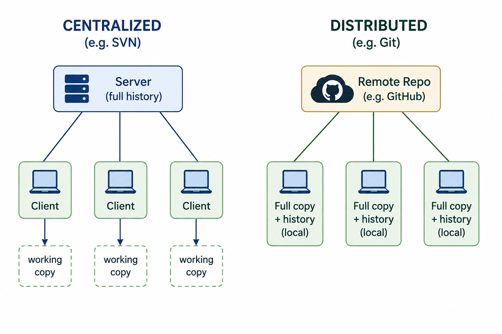

# Git & Version Control Systems

## 1. Why Version Control?

As a DevOps engineer, your daily work involves constantly **creating, editing, and saving text** — shell scripts, automation code, configuration files, pipelines, and more.

### The Problem Without Version Control

A common early approach: manually copy files with timestamps before making changes.

```bash
cp web_setup.sh web_setup.sh.27052025_1430     # backup before changes
```

This quickly becomes unmanageable:
- Dozens or hundreds of backup files accumulate
- Hard to compare versions
- Hard to know what changed between versions
- Hard to collaborate — who changed what and when?
- Rollback is manual and error-prone

### What a Version Control System (VCS) Does

A VCS is a tool that handles all of this automatically:

- Tracks **every change** ever made to your files
- Maintains a **complete history** — like a time machine
- Lets you **roll back** to any previous state instantly
- Shows **who made what change and when**
- Enables **team collaboration** on the same codebase
- Has **better versioning** than manual timestamps

> Version control is not just for developers — DevOps engineers use it for scripts, configs, automation code, infrastructure-as-code, and more.

---

## 2. Two Reasons DevOps Engineers Need Git

1. **Working with developers** — You fetch, build, test, and deploy their code. You need to understand how they manage code and "speak their language."

2. **Managing your own work** — Scripts, automation, and configs you write need to be versioned, shared with your team, and maintained over time.

---

## 3. Types of Version Control Systems

### Localized VCS
- Version history stored **only on your local machine**
- Good for individual work
- **Single point of failure** — if your machine fails, all history is lost

### Centralized VCS
- A **server** holds the complete, official copy of the code
- Clients **check out** (pull) a working copy to their machine
- Changes are **pushed back** to the server
- Server maintains all version history
- **Examples:** SVN (Subversion), CVS, Perforce
- **Problem:** If the server goes down, no one can work or commit changes — single point of failure at the server

### Distributed VCS ← Git uses this
- **Every user has a full, complete copy** of the entire repository including all history
- Changes are committed to your **local repository** first
- When ready, changes are **pushed** to the remote/central repository
- Others **pull** changes from the remote repository
- If the server goes down, everyone can still work locally — no single point of failure
- **Examples:** Git, Mercurial

---

## 4. Centralized vs Distributed 



In a distributed system, **every clone is a full backup** of the entire repository.

---

## 5. What is Git?

**Git** is a **distributed version control system** created by **Linus Torvalds** (the same person who created the Linux kernel). He built it to manage the versioning of the Linux kernel's own source code, and later made it available to everyone.

### Why Git is So Popular

- **Fast** — most operations are local, no network required
- **Fully distributed** — everyone has a complete copy
- **Supports non-linear development** — branching and merging
- **Handles large projects** — scales from small scripts to massive codebases
- **Easy to use** — powerful yet accessible

---

## 6. Key Git Concepts

| Concept | Meaning |
|---|---|
| **Repository (Repo)** | The database where all your files and their history are stored |
| **Clone** | Download the entire repository (full copy + history) to your local machine |
| **Commit** | Save a snapshot of your changes to the local repository |
| **Push** | Upload your local commits to the remote repository |
| **Pull** | Download and merge changes from the remote repository to your local copy |
| **Local repository** | The full copy of the repo on your machine |
| **Remote repository** | The shared repo hosted on a server (e.g. GitHub) |

### The Standard Git Workflow

```
1. Clone the remote repo to your local machine (first time)
         git clone <repo-url>

2. Make changes to files on your local machine

3. Commit your changes to the local repository
         git commit -m "description of changes"

4. Push your commits to the remote repository
         git push

5. Pull others' changes from the remote repository
         git pull
```

---

## 7. Remote Repository Providers

Git is a tool — you still need somewhere to host your remote repository. Popular cloud-based providers:

| Provider | Platform |
|---|---|
| **GitHub** | Most popular — owned by Microsoft |
| **Bitbucket** | Atlassian (integrates with Jira) |
| **AWS CodeCommit** | Amazon Web Services |
| **Azure Repos** | Microsoft Azure |
| **Google Cloud Source Repositories** | Google Cloud Platform |

---

## 8. Installing Git

### Check if Git is Already Installed
```bash
git --version
# git version 2.x.x   ← installed
# command not found   ← needs installing
```

### Install Git

| Platform | Command / Method |
|---|---|
| **Windows** | Already installed via Git Bash (from prerequisites) |
| **macOS** | Already installed via Homebrew: `brew install git` |
| **CentOS / RHEL** | `yum install git -y` |
| **Ubuntu / Debian** | `apt install git -y` |

> **Windows users** — Git Bash is the Git version control system. The terminal (bash shell) it provides is a bonus feature of the Git for Windows installer.

---

## 9. The Manual Backup Problem — Solved by Git

| Problem (Manual) | Git Solution |
|---|---|
| Copy file with timestamp before every change | `git commit` automatically snapshots changes |
| Hundreds of backup files accumulate | Git stores all history in a compact database |
| Hard to compare old versions | `git diff` shows exactly what changed |
| Hard to roll back | `git checkout` or `git revert` instantly restores any version |
| No record of who changed what | Every commit records the author, date, and message |
| Hard to collaborate | Push/pull/clone enables seamless team workflows |

---

## 10. Key Takeaways

- Version control solves the problem of manually managing backup files with timestamps — it automates all of that and much more.
- There are three types of VCS: **localized** (local only), **centralized** (server holds the master), and **distributed** (everyone has a full copy). Git is distributed.
- Centralized VCS (SVN, CVS) has a single point of failure at the server. Distributed VCS (Git) does not — every clone is a full backup.
- **Git** was created by Linus Torvalds — the creator of Linux — to version the Linux kernel itself.
- The core Git workflow is: **clone → make changes → commit → push**, and **pull** to get others' changes.
- Remote repository providers (GitHub, Bitbucket, AWS CodeCommit, etc.) host the shared central repo that teams push to and pull from.
- Git is not just for developers — DevOps engineers use it constantly for scripts, automation, configuration, and infrastructure-as-code.
- Most operations in Git are **local** — you don't need a network connection to commit, view history, or switch versions.

---