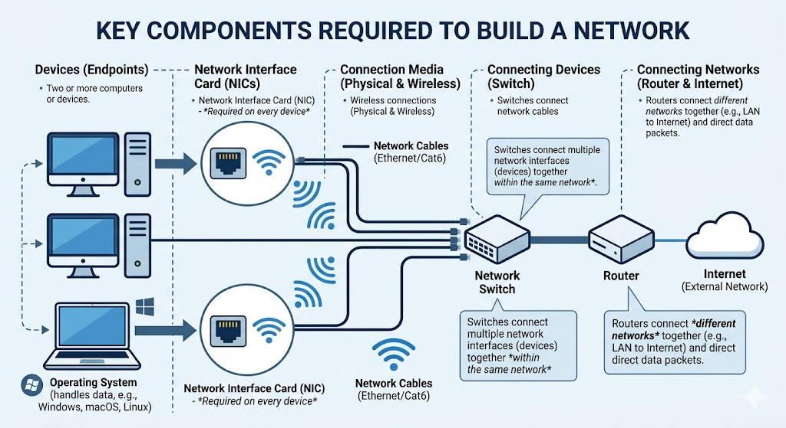
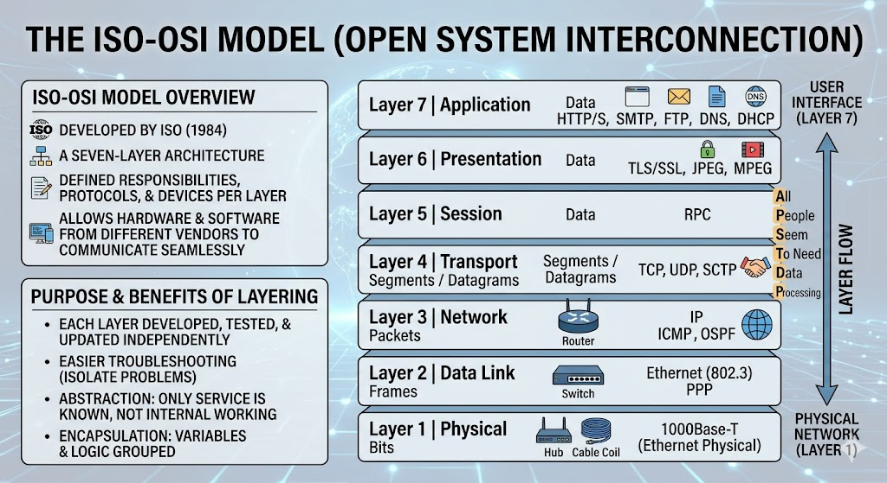
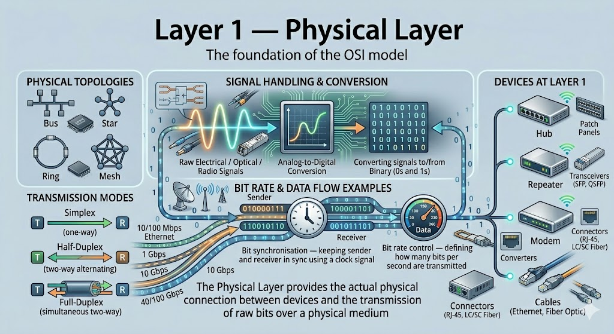
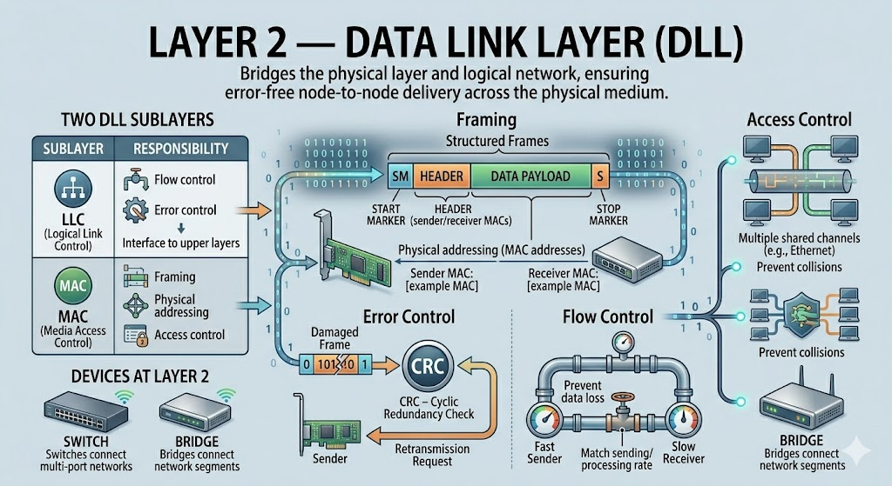
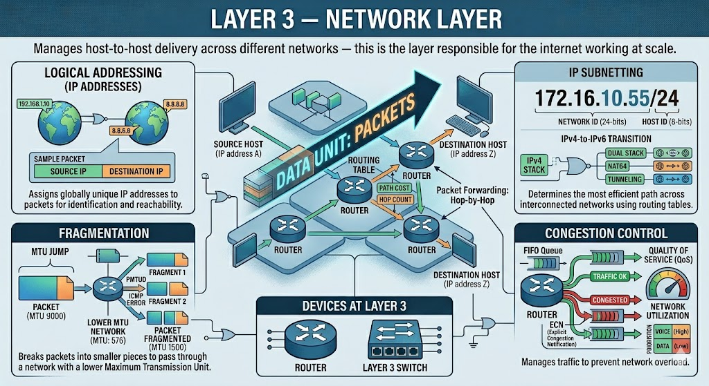
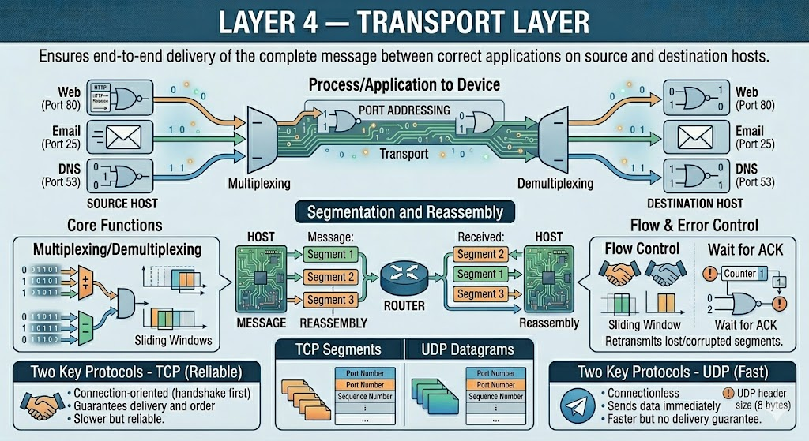
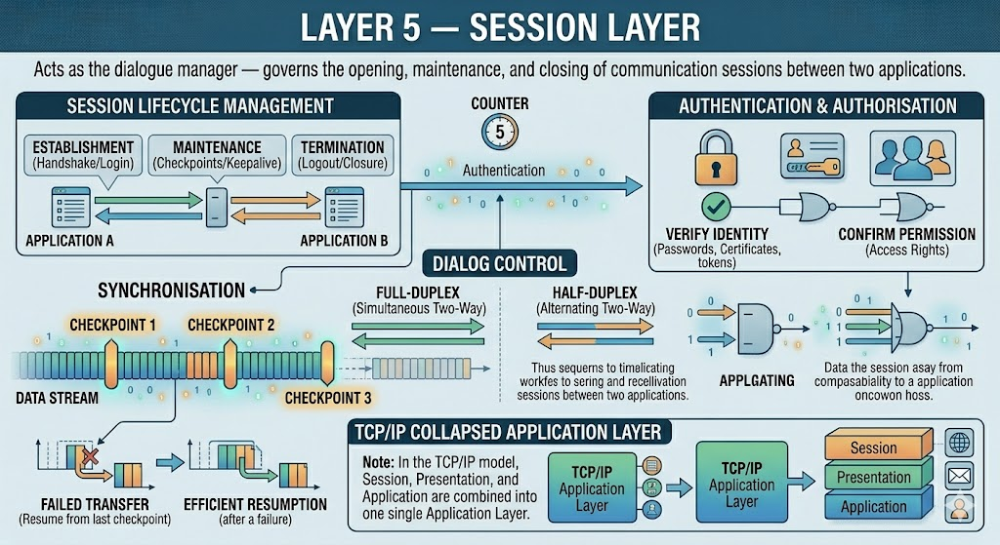
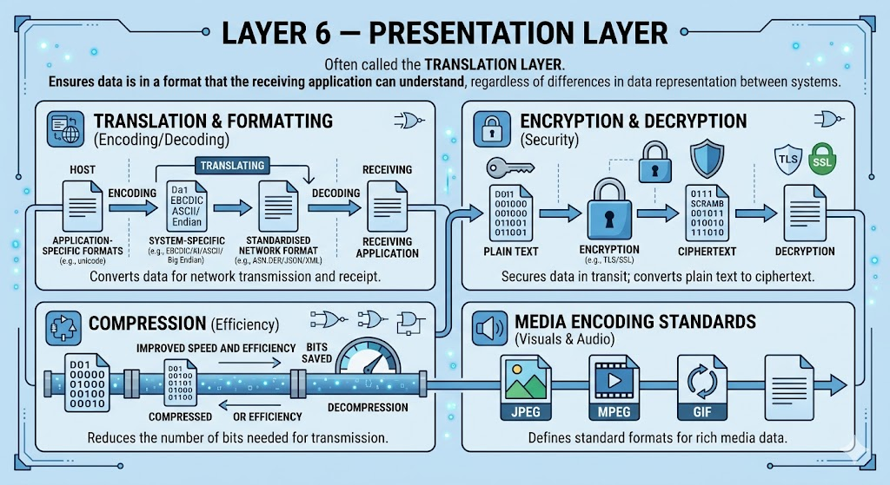
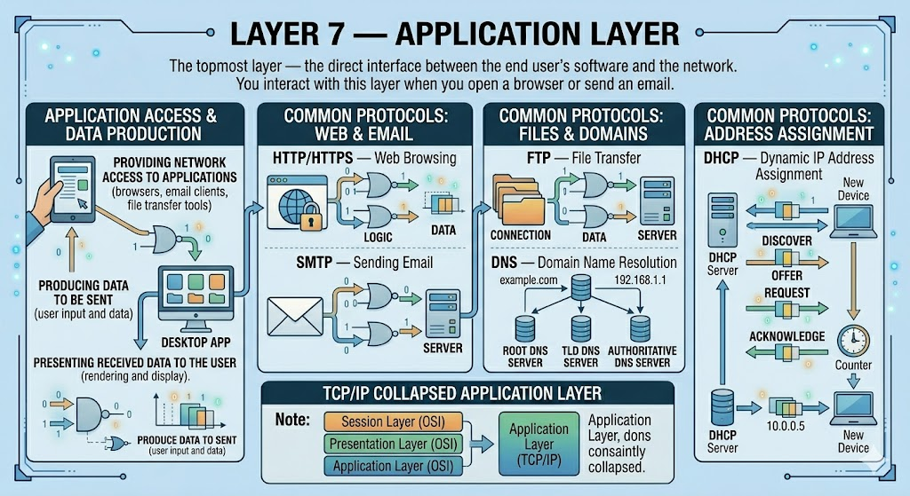
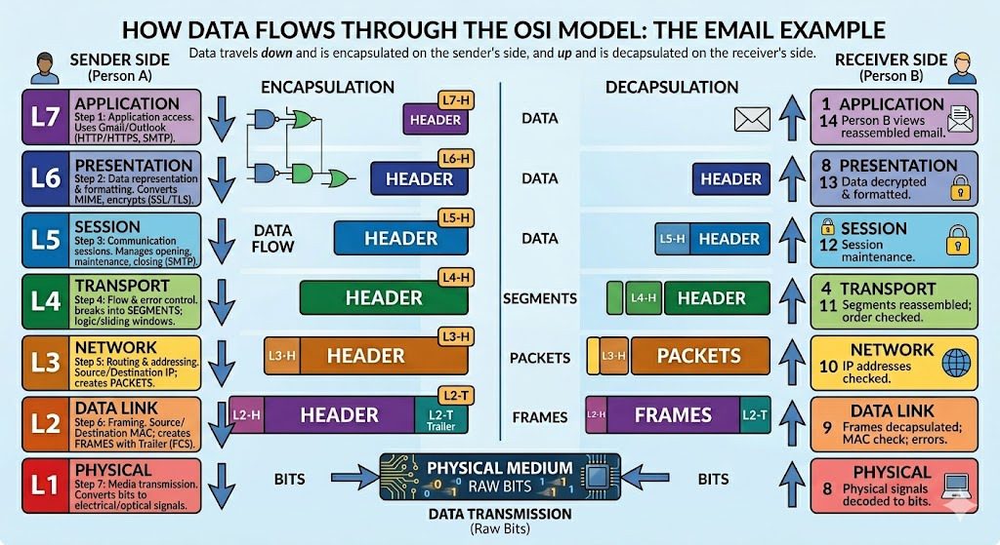

# Networking Fundamentals 

## Why Networking Matters for DevOps

As a DevOps engineer, you will be responsible for managing cloud computing environments, connecting multiple systems together, and automating infrastructure. Understanding networking is foundational to all of this — cloud, Docker, Kubernetes, and CI/CD pipelines all depend on systems communicating reliably over a network.

The rule applies here too: **understand how to do it manually before you automate it.**

---

## What Is a Computer Network?

A computer network is **communication between two or more network interfaces**. Every device on a network — a laptop, a smartphone, an IoT device — has at least one network interface (ethernet adapter, wireless adapter) with an IP address assigned to it. These interfaces allow devices to exchange data.

### Components Required to Build a Network

- Two or more computers or devices
- Cables or wireless connections linking the devices
- A **Network Interface Card (NIC)** on each device
- **Switches** to connect multiple network interfaces together
- **Routers** to connect multiple networks together
- An **operating system** on each device that can receive, interpret, and present network data to the user

---

## Why Standards Are Needed — The Problem

Billions of devices, operating systems, apps, and vendors exist worldwide. A smartphone from any manufacturer using any app can communicate with any server on the internet. This only works because **everyone follows the same standards**.

Think of it like language — if every country only spoke its own language, global communication would break down. The network equivalent is a universal set of rules that every device, app, and hardware vendor follows.

---

## The ISO-OSI Model

The **International Organization for Standardization (ISO)** developed the **Open System Interconnection (OSI)** model to define this universal standard. Together it is called the **ISO-OSI model**.

- Developed in **1984**
- A **seven-layer architecture**
- Every layer has defined responsibilities, protocols, and associated devices
- Allows hardware and software from different vendors to communicate seamlessly

The model divides network communication into layers so that:

- Each layer can be developed, tested, and updated **independently**
- Problems can be isolated to a specific layer for easier troubleshooting
- Each layer only needs to know what service it gets from the layer below — not how that layer works internally (**abstraction**)
- Variables and logic are grouped within their layer (**encapsulation**)

---

## The Seven Layers — Overview

The layers are numbered from bottom (hardware) to top (user-facing):

| Layer | Name | Data Unit | Key Devices/Protocols |
|-------|------|-----------|----------------------|
| 7 | Application | Data | HTTP/S, SMTP, FTP, DNS, DHCP |
| 6 | Presentation | Data | TLS/SSL, MIME, JPEG, MPEG |
| 5 | Session | Data | RPC |
| 4 | Transport | Segments / Datagrams | TCP, UDP, SCTP |
| 3 | Network | Packets | IP, ICMP, OSPF — Routers |
| 2 | Data Link | Frames | Ethernet, PPP — Switches, Bridges |
| 1 | Physical | Bits | Hubs, Repeaters, Cables |

A common mnemonic to remember the layers from top to bottom: **All People Seem To Need Data Processing**

---

## Each Layer in Detail

### Layer 1 — Physical Layer

The **foundation** of the OSI model. Responsible for the actual physical connection between devices and the transmission of raw bits (ones and zeros) over a medium.

**What it handles:**
- Transmitting and receiving raw electrical, optical, or radio signals
- Converting signals to and from binary (0s and 1s)
- **Bit synchronisation** — keeping sender and receiver in sync using a clock signal
- **Bit rate control** — defining how many bits per second are transmitted
- **Physical topology** — the layout of the network (Bus, Star, Ring, Mesh)
- **Transmission mode** — Simplex (one-way), Half-Duplex (two-way alternating), Full-Duplex (simultaneous two-way)

**Devices:** Hubs, Repeaters, Modems, Cables

---

### Layer 2 — Data Link Layer (DLL)

Bridges the raw physical layer and the logical network above it. Its primary job is to ensure **error-free node-to-node delivery** across the physical medium.

**What it handles:**

- **Framing** — assembles bits from the physical layer into structured units called **frames**, adding start and stop markers so the receiver knows where one frame ends and the next begins
- **Physical addressing (MAC addresses)** — every network interface card has a hardwired MAC address; the DLL adds sender and receiver MAC addresses to each frame header
- **Error control** — detects and requests retransmission of damaged or lost frames (using CRC — Cyclic Redundancy Check)
- **Flow control** — matches the sending rate to the receiver's processing rate to prevent data loss
- **Access control** — when multiple devices share a channel, determines which device transmits at a given time to prevent collisions

**Two sublayers:**

| Sublayer | Responsibility |
|----------|---------------|
| **LLC** (Logical Link Control) | Flow control, error control, interface to upper layers |
| **MAC** (Media Access Control) | Framing, physical addressing, access control |

**Devices:** Switches, Bridges

---

### Layer 3 — Network Layer

Manages **host-to-host delivery across different networks** — this is the layer responsible for the internet working at scale.

**What it handles:**

- **Logical addressing (IP addresses)** — assigns globally unique IP addresses to packets so any device anywhere can be identified and reached
- **Routing** — determines the most efficient path from source to destination across interconnected networks using routing tables
- **Packet forwarding** — routers at this layer read the destination IP address and forward packets hop by hop toward the destination
- **Fragmentation** — breaks packets into smaller pieces when passing through a network with a lower Maximum Transmission Unit (MTU)
- **Congestion control** — manages traffic to prevent network overload

**Data unit:** Packets

**Devices:** Routers, Layer 3 Switches

---

### Layer 4 — Transport Layer

Ensures **end-to-end delivery of the complete message** between the correct applications on source and destination hosts. The network layer gets the packet to the right device; the transport layer gets it to the right application (port) on that device.

**What it handles:**

- **Port addressing** — uses port numbers to identify the specific application or process on the destination host (e.g. port 80 for web traffic, port 25 for email)
- **Segmentation and reassembly** — breaks large messages into segments for transmission and reassembles them in the correct order at the destination
- **Flow control** and **error control** — retransmits lost or corrupted segments
- **Multiplexing/demultiplexing** — allows multiple applications to use the network simultaneously

**Two key protocols:**

| Protocol | Type | Behaviour |
|----------|------|-----------|
| **TCP** (Transmission Control Protocol) | Connection-oriented | Establishes a connection (handshake) first; guarantees delivery and order; slower but reliable |
| **UDP** (User Datagram Protocol) | Connectionless | Sends data immediately without establishing a connection; faster but no delivery guarantee |

**Data unit:** Segments (TCP) / Datagrams (UDP)

---

### Layer 5 — Session Layer

Acts as the **dialogue manager** — governs the opening, maintenance, and closing of communication sessions between two applications.

**What it handles:**

- **Session establishment, maintenance, and termination** — manages the lifecycle of a connection between applications
- **Authentication and authorisation** — verifies the identities of communicating parties
- **Synchronisation** — inserts checkpoints into the data stream so a failed transfer can resume from the last checkpoint rather than restarting from scratch
- **Dialog control** — determines whether communication is half-duplex or full-duplex

> In the TCP/IP model (the practical implementation used on the internet), the Session, Presentation, and Application layers are collapsed into a single Application layer.

---

### Layer 6 — Presentation Layer

Often called the **Translation Layer**. Ensures data is in a format that the receiving application can understand, regardless of differences in data representation between systems.

**What it handles:**

- **Translation** — converts data from application-specific formats into a standardised network format for transmission, and back again on receipt
- **Encryption and decryption** — secures data in transit by converting plain text to ciphertext (handled by protocols like TLS/SSL)
- **Compression** — reduces the number of bits needed for transmission to improve speed and efficiency
- **Media encoding standards** — JPEG, MPEG, GIF

---

### Layer 7 — Application Layer

The **topmost layer** — the direct interface between the end user's software and the network. This is what you interact with every time you open a browser or send an email.

**What it handles:**

- Providing network access to applications (browsers, email clients, file transfer tools)
- Producing data to be sent and presenting received data to the user

**Common protocols:**

| Protocol | Purpose |
|----------|---------|
| **HTTP/HTTPS** | Web browsing |
| **SMTP** | Sending email |
| **FTP** | File transfer |
| **DNS** | Domain name resolution |
| **DHCP** | Dynamic IP address assignment |

---

## How Data Flows Through the OSI Model

Data travels **down** through all seven layers on the sender's side, across the physical medium, and **up** through all seven layers on the receiver's side. Each layer adds its own header information (a process called **encapsulation**) on the way down, and strips it off (decapsulation) on the way up.

### Example: Sending an Email from Person A to Person B

| Step | Layer | What Happens |
|------|-------|-------------|
| 1 | **Application** | Person A writes the email in Gmail/Outlook |
| 2 | **Presentation** | Email data is formatted and encrypted |
| 3 | **Session** | A connection is established between sender and receiver |
| 4 | **Transport** | Email is broken into segments; sequence numbers and error-checking added |
| 5 | **Network** | Source and destination IP addresses added; best route determined |
| 6 | **Data Link** | Data packaged into frames; MAC addresses added; error detection applied |
| 7 | **Physical** | Frames converted to electrical/optical signals and transmitted over the cable or WiFi |

On Person B's side, the process reverses — physical signals are decoded back up through each layer until the email is reassembled and displayed in the email client.

---

## Two Types of OSI Functions

| Type | Examples |
|------|---------|
| **Mandatory** — must be implemented for communication to work | Error control, flow control, access control, addressing, multiplexing/demultiplexing |
| **Optional** — can be implemented if needed | Encryption/decryption, checkpointing, routing (can be replaced by flooding) |

---

## Quick Reference: Layers, Devices, and Protocols

| Layer | Name | PDU | Devices | Protocols |
|-------|------|-----|---------|-----------|
| 7 | Application | Data | Web servers, mail servers, browsers | HTTP/S, SMTP, FTP, DNS, DHCP |
| 6 | Presentation | Data | — | TLS/SSL, MIME, JPEG, MPEG |
| 5 | Session | Data | — | RPC |
| 4 | Transport | Segments/Datagrams | Gateways | TCP, UDP, SCTP |
| 3 | Network | Packets | Routers, L3 Switches | IP, ICMP, IGMP, OSPF |
| 2 | Data Link | Frames | Switches, Bridges | Ethernet, PPP, PPTP |
| 1 | Physical | Bits | Hubs, Repeaters, Modems, Cables | USB, SONET/SDH |

---

## What You Need to Remember

For practical DevOps and networking work, focus on:

1. **The name and purpose of every layer**
2. **The devices associated with each layer** — especially that switches are Layer 2 (MAC addresses) and routers are Layer 3 (IP addresses)
3. **The protocols at each layer** — particularly TCP/UDP at Layer 4 and HTTP/DNS/SMTP at Layer 7
4. **The data unit at each layer** — bits → frames → packets → segments → data

---

## Next Topics in Networking

The networking session continues with:

- Classification of networks by geography (LAN, WAN, MAN)
- Networking devices in depth
- Understanding your home network
- IP addresses and address ranges
- Protocols
- DNS and DHCP
- Practical networking commands for troubleshooting

---