# Networking Fundamentals

## Why Networking Matters for DevOps

As a DevOps engineer you will manage cloud environments, connect multiple systems, and automate infrastructure. Cloud, Docker, Kubernetes, and CI/CD pipelines all depend on reliable network communication. This session is ~90% theory with practical commands at the end — the commands will be invaluable when troubleshooting connectivity between systems.

The golden rule applies here: **understand how to do things manually before you automate them.**

---

## 1. Classification of Networks by Geography

Networks are classified based on the **distance between the communicating network interfaces**. As an example: your laptop's network interface and a Google server's network interface are communicating — the distance between them defines the network type.

| Type | Full Name | Coverage | Example |
|------|-----------|----------|---------|
| **PAN** | Personal Area Network | < 10 metres | Bluetooth, personal hotspot |
| **LAN** | Local Area Network | Up to ~2 km | Home network, office floor, school lab |
| **CAN** | Campus Area Network | A few acres | Office campus, university campus (also called Intranet) |
| **MAN** | Metropolitan Area Network | 5–50 km | City municipality network, metro train system |
| **WAN** | Wide Area Network | > 50 km, global | The Internet |

The **Internet** is the largest example of a WAN. When you access a website hosted in a European data centre from your smartphone, that traffic travels over a WAN.

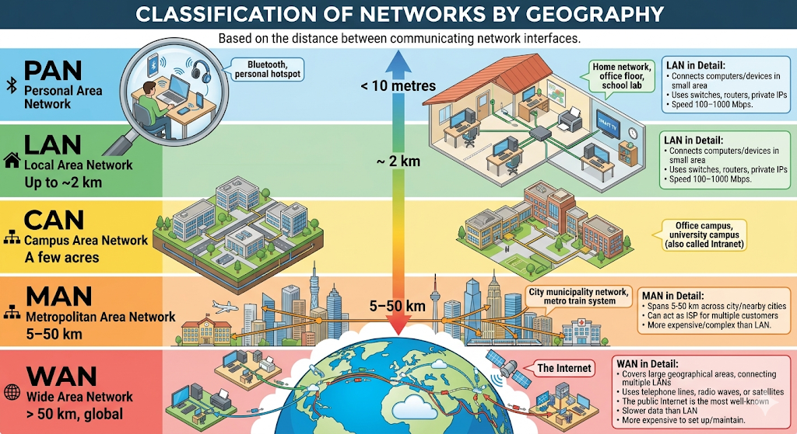

### LAN in Detail

- Connects computers and devices within a small area (home, office, school)
- Uses switches, routers, and private IP addresses
- Speed: 100–1000 Mbps on modern networks
- Example: students playing a multiplayer game in the same room without internet

### MAN in Detail

- Spans 5–50 km across a city or between nearby cities
- Can act as an ISP for multiple customers
- More expensive and complex to set up than a LAN
- Example: a city-wide municipality computer network

### WAN in Detail

- Covers large geographical areas, often connecting multiple LANs
- Uses telephone lines, radio waves, or satellites
- The public Internet is the most well-known WAN
- Slower data transfer than LAN; more expensive to set up and maintain

---

## 2. Networking Devices

### Layer 1 — Physical Layer Devices

These devices deal with raw electrical or optical signals (bits). They do **not** understand IP addresses or MAC addresses.

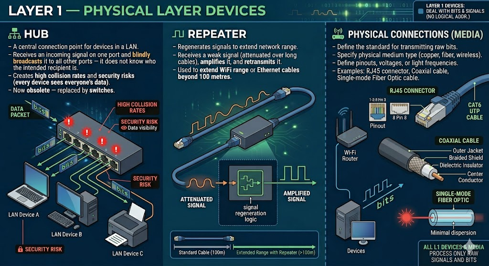

**Hub**
- A central connection point for devices in a LAN
- Receives an incoming signal on one port and **blindly broadcasts** it to all other ports — it does not know who the intended recipient is
- Creates high collision rates and security risks (every device sees everyone's data)
- Now obsolete — replaced by switches

**Repeater**
- Regenerates signals to extend network range
- Receives a weak signal (attenuated over long cables), amplifies it, and retransmits it
- Used to extend WiFi range or Ethernet cables beyond 100 metres

**Modem (Modulator-Demodulator)**
- Bridges the gap between your digital home network and the analog signals used by telephone/cable/fiber lines
- Connects your home network to the ISP
- Converts digital → analog (Modulation) and analog → digital (Demodulation)

---

### Layer 2 — Data Link Layer Devices

These devices work with **MAC addresses** (physical hardware addresses). They are smarter than Layer 1 devices.

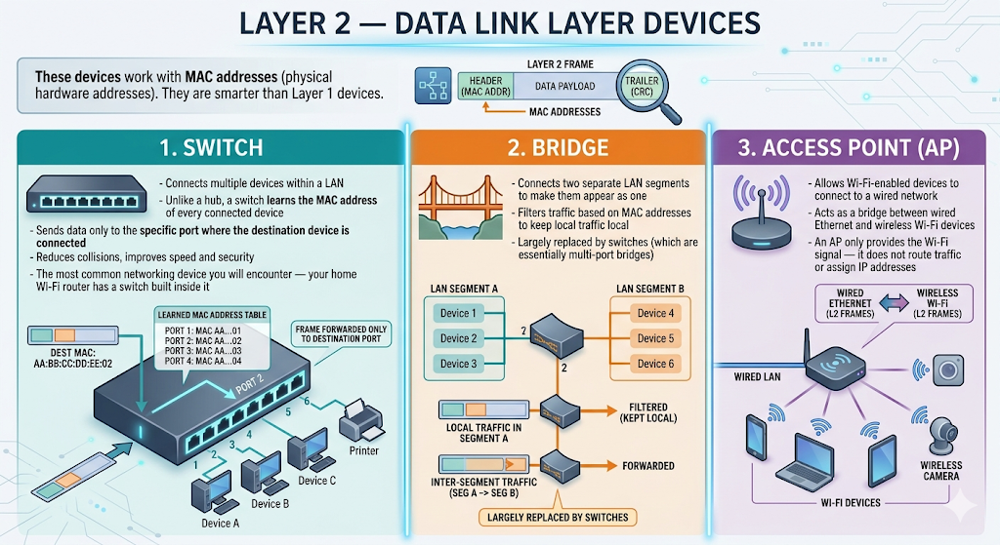

**Switch**
- Connects multiple devices within a LAN
- Unlike a hub, a switch **learns the MAC address** of every connected device
- Sends data only to the specific port where the destination device is connected
- Reduces collisions, improves speed and security
- The most common networking device you will encounter — your home Wi-Fi router has a switch built inside it

**Bridge**
- Connects two separate LAN segments to make them appear as one
- Filters traffic based on MAC addresses to keep local traffic local
- Largely replaced by switches (which are essentially multi-port bridges)

**Access Point (AP)**
- Allows Wi-Fi-enabled devices to connect to a wired network
- Acts as a bridge between wired Ethernet and wireless Wi-Fi devices
- An AP only provides the Wi-Fi signal — it does not route traffic or assign IP addresses

---

### Layer 3 — Network Layer Devices

These devices work with **IP addresses** (logical addresses) and connect different networks together.

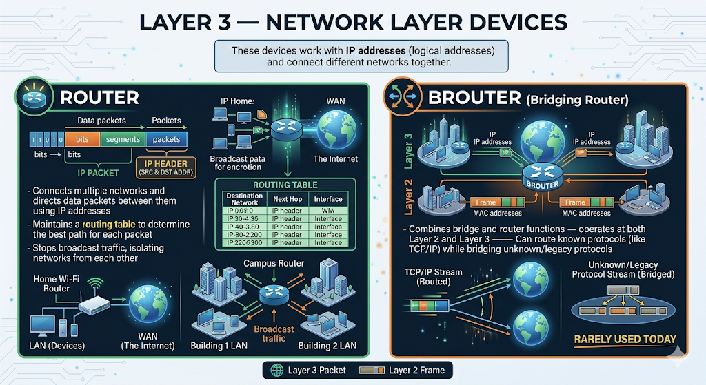

**Router**
- Connects multiple networks and directs data packets between them using IP addresses
- Maintains a **routing table** to determine the best path for each packet
- Stops broadcast traffic, isolating networks from each other
- Examples: your home Wi-Fi router connects your LAN to the Internet; a campus router connects Building 1's LAN to Building 2's LAN

**Brouter (Bridging Router)**
- Combines bridge and router functions — operates at both Layer 2 and Layer 3
- Can route known protocols (like TCP/IP) while bridging unknown/legacy protocols
- Rarely used today

---

### Layer 4–7 — Advanced Processing Devices

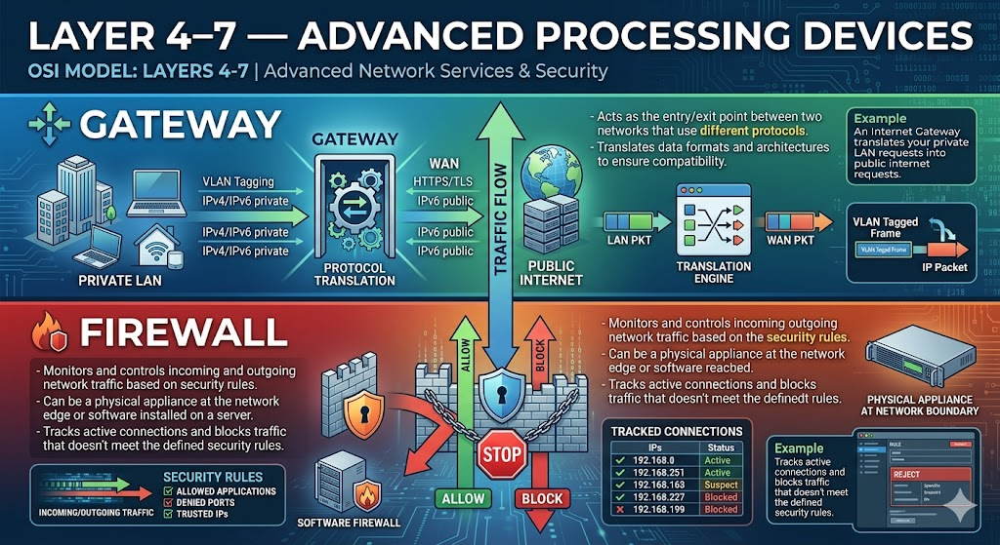

**Gateway**
- Acts as the entry/exit point between two networks that use **different protocols**
- Translates data formats and architectures to ensure compatibility
- Example: an Internet Gateway translates your private LAN requests into public internet requests

**Firewall**
- Monitors and controls incoming and outgoing network traffic based on security rules
- Can be a physical appliance at the network edge or software installed on a server
- Tracks active connections and blocks traffic that doesn't meet the defined security rules

---

### Hub vs Switch vs Router — Quick Comparison

| Feature | Hub | Switch | Router |
|---------|-----|--------|--------|
| OSI Layer | Layer 1 (Physical) | Layer 2 (Data Link) | Layer 3 (Network) |
| Address type | None (bits) | MAC address | IP address |
| Data flow | Broadcast (to all ports) | Unicast (to destination only) | Routes along best path |
| Intelligence | Dumb | Smart | Smarter |
| Used for | Obsolete | Connecting devices (LAN) | Connecting networks (WAN) |

---

## 3. Understanding Your Home Network

Your home network is the simplest real-world example of a full network stack. Understand it and you can understand any corporate or data centre network.

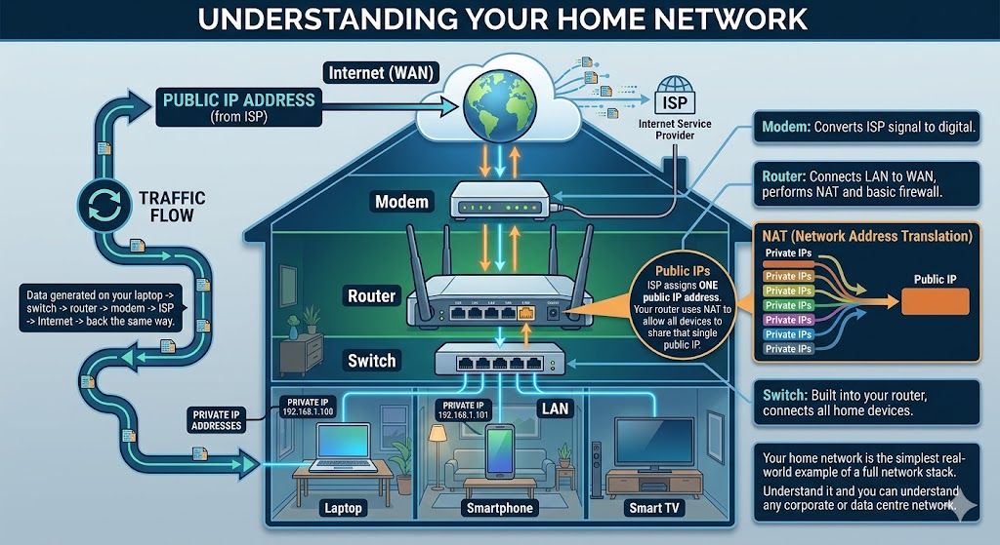

**Traffic flow:** Data generated on your laptop → switch → router → modem → ISP → Internet → back the same way.

Every device on the network has an IP address: your laptop, your phone, your router, your smart TV.

**NAT (Network Address Translation):** Your ISP assigns you **one public IP address**. Your router uses NAT to allow all devices in your home to share that single public IP when accessing the internet. Inside your home, all devices use private IP addresses.

### Corporate/Data Centre Networks

A corporate network is the same concept scaled up for high availability and security:

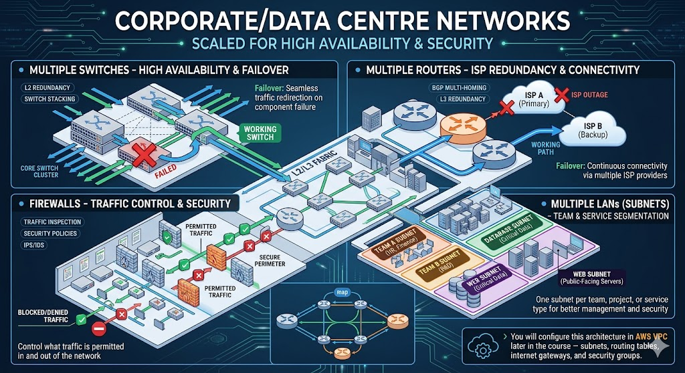

- **Multiple switches** — if one fails, traffic flows through another
- **Multiple routers** — connected to multiple ISPs for redundancy; if one ISP goes down, connectivity continues
- **Firewalls** — control what traffic is permitted in and out
- **Multiple LANs (subnets)** — one per team, project, or service type (database subnet, web subnet, etc.)

> You will configure this architecture in **AWS VPC** later in the course — subnets, routing tables, internet gateways, and security groups.

---

## 4. IP Addresses and Address Ranges

### What Is an IP Address?

An IP address is a **unique numerical identifier** assigned to each device's network interface. It serves two purposes:
- **Identification** — uniquely identifies a device on a network
- **Location addressing** — enables routing of data to the correct destination

### IPv4 Structure

An IPv4 address is a **32-bit binary number** written in **dotted decimal notation** — four decimal numbers (octets) separated by dots, each representing 8 bits:

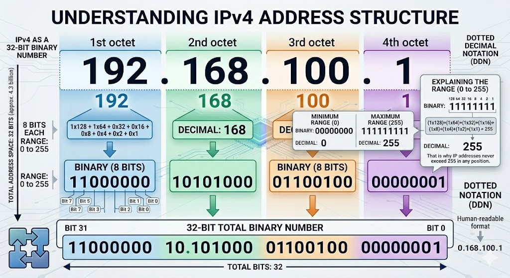

Each octet runs from `00000000` to `11111111` in binary, which is `0` to `255` in decimal. `11111111` binary = 255 decimal — that is why IP addresses never exceed 255 in any position.

### IPv4 vs IPv6

| Feature | IPv4 | IPv6 |
|---------|------|------|
| Size | 32-bit | 128-bit |
| Format | Decimal (`192.168.1.1`) | Hexadecimal (`2001:db8::1`) |
| Total addresses | ~4.3 billion | ~340 undecillion |
| IPSec | Optional | Built-in |
| NAT required | Yes | No |

IPv4 is still the most widely used protocol. IPv6 builds on the same concepts and was created to address IPv4 exhaustion.

### Public vs Private IP Addresses

| Type | Who uses it | Purpose |
|------|-------------|---------|
| **Public IP** | ISPs, cloud providers | Unique identity on the Internet; globally routable |
| **Private IP** | Anyone building a local network | Used within private networks; not routable on the Internet |

When you subscribe to an ISP, they assign you a public IP. Inside your home or office you use private IPs. The router uses NAT to translate between them.

### IP Address Classes

IPv4 addresses are divided into five classes based on the leading bits of the first octet:

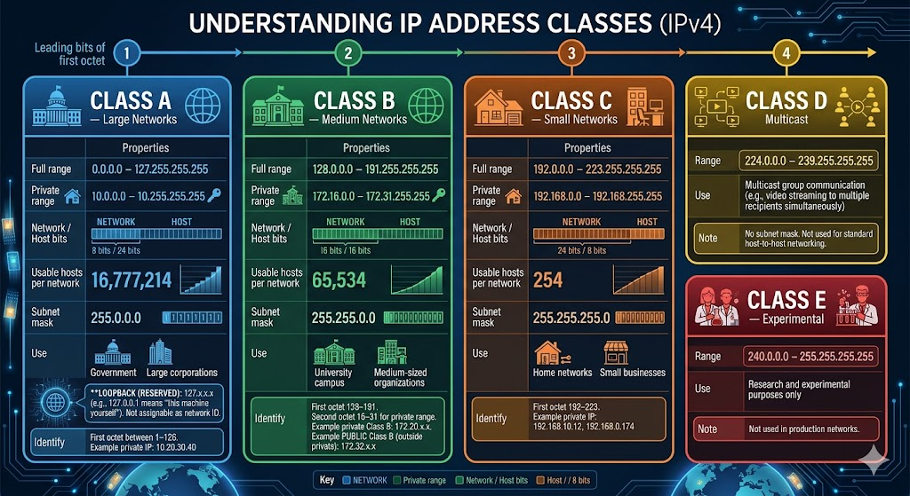

#### Class A — Large Networks

| Property | Value |
|----------|-------|
| Full range | `0.0.0.0` – `127.255.255.255` |
| Private range | `10.0.0.0` – `10.255.255.255` |
| Network / Host bits | 8 / 24 |
| Usable hosts per network | 16,777,214 |
| Subnet mask | `255.0.0.0` |
| Use | Large organisations, governments |

> `127.x.x.x` is reserved for **loopback** — `127.0.0.1` means "this machine itself" (localhost). Not assignable as a network ID.

**Identify:** First octet between 1–126. Example private IP: `10.20.30.40`

#### Class B — Medium Networks

| Property | Value |
|----------|-------|
| Full range | `128.0.0.0` – `191.255.255.255` |
| Private range | `172.16.0.0` – `172.31.255.255` |
| Network / Host bits | 16 / 16 |
| Usable hosts per network | 65,534 |
| Subnet mask | `255.255.0.0` |
| Use | Universities, medium-sized organisations |

**Identify:** First octet 128–191. The **second octet** must be 16–31 for the private range. So `172.20.x.x` is private Class B, but `172.32.x.x` is **public** (second octet 32 is outside the private range).

#### Class C — Small Networks

| Property | Value |
|----------|-------|
| Full range | `192.0.0.0` – `223.255.255.255` |
| Private range | `192.168.0.0` – `192.168.255.255` |
| Network / Host bits | 24 / 8 |
| Usable hosts per network | 254 |
| Subnet mask | `255.255.255.0` |
| Use | Home networks, small businesses |

**Identify:** First octet 192–223. Example: `192.168.10.12`, `192.168.0.174`

#### Class D — Multicast

| Range | Use |
|-------|-----|
| `224.0.0.0` – `239.255.255.255` | Multicast group communication (e.g. video streaming to multiple recipients simultaneously) |

No subnet mask. Not used for standard host-to-host networking.

#### Class E — Experimental

| Range | Use |
|-------|-----|
| `240.0.0.0` – `255.255.255.255` | Research and experimental purposes only |

Not used in production networks.

### How class ranges are calculated

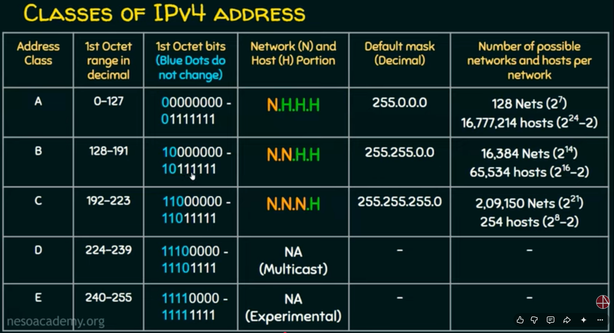

### IP Class Quick Reference

| Class | Range (1st octet) | Private Range | Hosts/Network | Use |
|-------|-------------------|--------------|--------------|-----|
| A | 1–126 | 10.0.0.0–10.255.255.255 | 16,777,214 | Large networks |
| B | 128–191 | 172.16.0.0–172.31.255.255 | 65,534 | Medium networks |
| C | 192–223 | 192.168.0.0–192.168.255.255 | 254 | Small/home networks |
| D | 224–239 | — | — | Multicast only |
| E | 240–255 | — | — | Experimental only |

### Special Reserved Addresses

| Range | Purpose |
|-------|---------|
| `127.0.0.1` | Loopback — refers to the local machine (localhost) |
| `169.254.0.0/16` | Link-local — auto-assigned when no DHCP server is reachable |
| `0.0.0.0` | "All interfaces" — used in service configs (Memcached, RabbitMQ) |
| `255.255.255.255` | Broadcast to all devices on the local network |

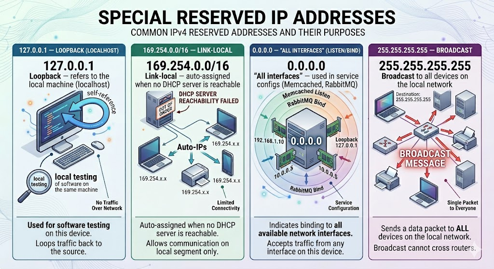

### Reading an IP — Practical Examples

| IP Address | Class | Public or Private? |
|------------|-------|--------------------|
| `192.168.10.12` | C | Private |
| `10.50.200.1` | A | Private |
| `172.20.19.68` | B | Private |
| `172.32.36.87` | — | **Public** (2nd octet 32 is outside Class B private range 16–31) |
| `8.8.8.8` | A | **Public** (Google DNS) |
| `127.0.0.1` | — | Loopback (this machine) |

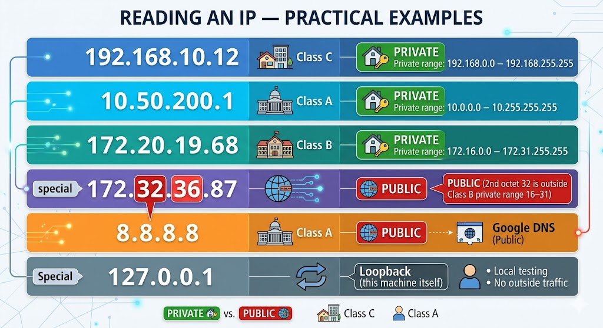

---

## 5. Protocols

A **network protocol** is a set of rules that governs how data is transmitted, received, and interpreted between devices — regardless of their internal design or operating system. Without protocols, devices from different vendors and operating systems could not communicate.

Protocols are grouped into three categories:

### Network Communication Protocols

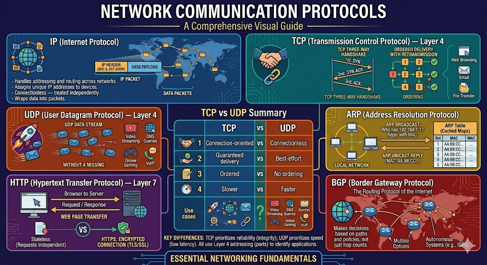

**IP (Internet Protocol)**
- Handles addressing and routing of data packets across networks
- Assigns unique IP addresses to devices
- Connectionless — each packet is treated independently
- Wraps data into packets containing source and destination addresses

**TCP (Transmission Control Protocol) — Layer 4**
- Connection-oriented — establishes a session via a **three-way handshake** (SYN → SYN-ACK → ACK) before sending data
- Guarantees reliable, ordered, error-checked delivery
- Retransmits lost packets
- Used when data integrity matters: web browsing, email, file transfer

**UDP (User Datagram Protocol) — Layer 4**
- Connectionless — sends data immediately without a handshake
- No guaranteed delivery, no ordering, no retransmission
- Much faster than TCP due to minimal overhead
- Used when speed matters more than reliability: video streaming, DNS queries, online gaming, VoIP

**TCP vs UDP Summary**

| Feature | TCP | UDP |
|---------|-----|-----|
| Connection | Connection-oriented (handshake) | Connectionless |
| Reliability | Guaranteed delivery | Best-effort, no guarantee |
| Order | Packets arrive in order | No ordering |
| Speed | Slower | Faster |
| Use cases | HTTP, email, file transfer | Streaming, DNS, gaming, VoIP |

**HTTP (Hypertext Transfer Protocol) — Layer 7**
- Used for transferring web pages between browsers and web servers
- Stateless — each request is independent
- Inherently insecure; **HTTPS** (HTTP + TLS/SSL) encrypts the connection

**ARP (Address Resolution Protocol)**
- Maps a logical IP address to a physical MAC address within a local network
- When a device knows the IP of a destination but not its MAC address, it sends an ARP broadcast: "Who has this IP? Reply with your MAC."
- The response is cached in the ARP table to reduce future broadcasts

**BGP (Border Gateway Protocol)**
- The routing protocol of the Internet — exchanges routing information between large networks (Autonomous Systems, e.g. ISPs)
- Makes decisions based on paths and policies rather than simple hop counts

---

### Network Management Protocols

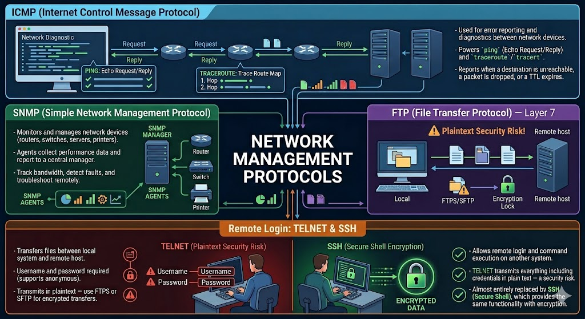

**ICMP (Internet Control Message Protocol)**
- Used for error reporting and diagnostics between network devices
- Powers `ping` (Echo Request/Reply) and `traceroute`/`tracert`
- Reports when a destination is unreachable, a packet is dropped, or a TTL expires

**SNMP (Simple Network Management Protocol)**
- Monitors and manages network devices (routers, switches, servers, printers)
- Agents on devices collect performance data and report to a central SNMP manager
- Enables administrators to track bandwidth, detect faults, and troubleshoot remotely

**FTP (File Transfer Protocol) — Layer 7**
- Transfers files between a local system and a remote host
- Requires username and password (supports anonymous sessions)
- Transmits in plaintext — use FTPS or SFTP for encrypted transfers

**Telnet**
- Allows remote login and command execution on another system
- Transmits everything including credentials in plain text — a security risk
- Almost entirely replaced by **SSH (Secure Shell)**, which provides the same functionality with encryption

---

### Network Security Protocols

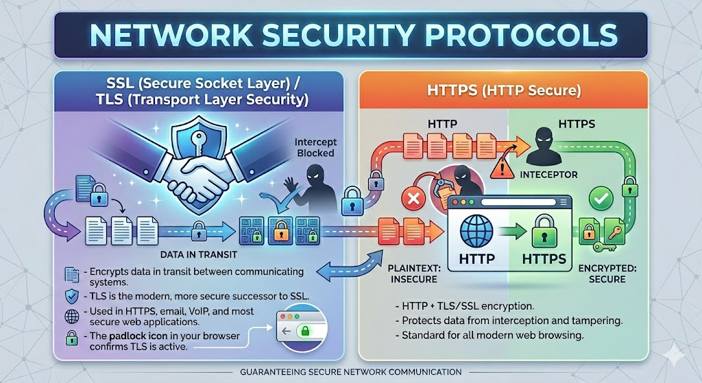

**SSL (Secure Socket Layer) / TLS (Transport Layer Security)**
- Encrypts data in transit between communicating systems
- TLS is the modern, more secure successor to SSL
- Used in HTTPS, email, VoIP, and most secure web applications
- The padlock icon in your browser confirms TLS is active

**HTTPS (HTTP Secure)**
- HTTP + TLS/SSL encryption
- Protects data from interception and tampering
- Standard for all modern web browsing

---

## 6. DNS and DHCP

### DNS — Domain Name System

**DNS translates human-readable domain names into IP addresses.**

When you type `www.google.com` into a browser, your computer does not search for "google.com" — it finds the IP address associated with that name and connects to it. DNS is the service that performs this translation.

Think of DNS like a telephone directory: you look up a name to find a number. Without DNS, you would need to remember the IP address of every website.

**How DNS Works:**

```
1. You type www.google.com in your browser
2. Your computer checks its local DNS cache
3. If not cached, it queries your configured DNS server
4. The DNS server resolves the name to an IP address (e.g. 142.250.70.46)
5. Your browser connects to that IP address
6. The website loads
```

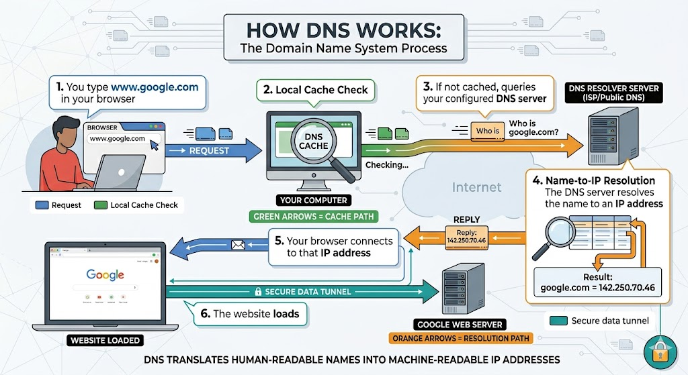

DNS is a **hierarchical, decentralised** system:
- **Root** (`.`) — the top, knows where TLD servers are
- **TLD** (`.com`, `.org`, `.uk`) — knows where second-level domains are
- **Second-level domain** (`google.com`) — the authoritative server for that domain

**Key DNS properties:**

| Property | Value |
|----------|-------|
| Port | 53 |
| Protocols | UDP and TCP |
| Architecture | Decentralised |
| Function | Domain name → IP address (and IP → domain name) |

**Advantages:**
- Users don't need to remember IP addresses
- Enables load balancing (one domain can resolve to multiple IPs)
- Fast resolution of frequently accessed sites via caching

**Disadvantages:**
- Vulnerable to DNS spoofing and DDoS attacks
- Requires proper configuration and maintenance of DNS records

---

### DHCP — Dynamic Host Configuration Protocol

**DHCP automatically assigns IP addresses and network configuration to devices when they connect to a network.**

Without DHCP, every device on your network would need to be manually assigned an IP address, subnet mask, gateway, and DNS server. DHCP automates all of this.

**How DHCP Works:**

```
1. Device connects to the network
2. Device broadcasts: "Can anyone assign me an IP address?"
3. DHCP server responds with: IP address, subnet mask, default gateway, DNS server
4. Device uses this configuration for the duration of the "lease time"
5. Before the lease expires, the device automatically renews it
```

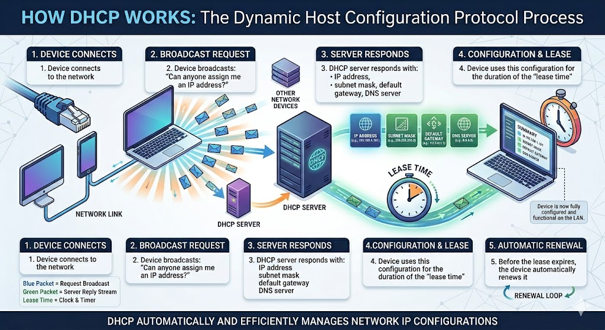

**Key DHCP properties:**

| Property | Value |
|----------|-------|
| Ports | 67 (server), 68 (client) |
| Protocol | UDP only |
| Architecture | Centralised |
| Function | Automatically assigns IP addresses and network config to devices |

**Advantages:**
- Eliminates manual IP configuration for every device
- Prevents IP conflicts through centralised management
- Efficient — IP addresses are reclaimed when devices leave the network

**Disadvantages:**
- If the DHCP server goes down, new devices cannot get IP addresses
- Misconfiguration can cause IP conflicts

---

### DNS vs DHCP — Key Differences

| Feature | DNS | DHCP |
|---------|-----|------|
| Full name | Domain Name System | Dynamic Host Configuration Protocol |
| Port | 53 | 67 (server), 68 (client) |
| Protocol | UDP and TCP | UDP only |
| Architecture | Decentralised | Centralised |
| Function | Translates domain names to IP addresses | Assigns IP addresses to devices automatically |
| Benefit | No need to remember IP addresses | No need to manually configure devices |

**How they work together:** When a device joins a network, DHCP assigns it an IP address and also tells it which DNS server to use. From that point, the device uses DNS to resolve domain names. DHCP gets you on the network; DNS gets you to the right place on it.

---

## 7. Practical Networking Commands

These commands are essential for troubleshooting connectivity between systems — a key DevOps skill.

---

### `ifconfig` / `ip addr` — View Network Interface Configuration (Linux)

```bash
ifconfig
# or on modern Linux:
ip addr
```

Shows IP address, subnet mask, MAC address, and status of all network interfaces. Useful for confirming what IP address a VM or server has been assigned.

---

### `ipconfig` — View IP Configuration (Windows)

```
ipconfig
```

Shows IPv4 address, subnet mask, and default gateway for each network adapter.

```
ipconfig /all
```

Extended version — also shows MAC address (Physical Address), DHCP server details, DNS server, IPv6 address, and lease information.

---

### `ping` — Test Connectivity

```bash
ping google.com
ping 8.8.8.8
ping app01
```

Sends ICMP Echo Request packets to a destination and reports whether responses are received. Used to check:
- Whether a host is reachable
- Round-trip time (latency)
- Packet loss

If you get `100% loss`, the destination is either unreachable, the hostname doesn't resolve, or ICMP is being blocked.

---

### `traceroute` / `tracert` — Trace the Network Path

```bash
# Linux/Mac:
traceroute google.com

# Windows:
tracert google.com
```

Shows every router (hop) the packet passes through on the way to the destination, with latency at each hop. Maximum 30 hops shown. Used to diagnose where in the network path a connection is failing or slow.

---

### `nslookup` — Query DNS

```bash
nslookup google.com
nslookup 8.8.8.8
```

Translates a domain name to its IP address (or vice versa). Used to verify DNS resolution is working correctly. If a hostname like `app01` doesn't resolve, check `/etc/hosts` or the DNS configuration.

---

### `netstat` — View Active Connections and Ports

```bash
netstat
netstat -tulpn    # Linux: show listening ports with process names
netstat -n        # show numeric addresses (no DNS resolution)
netstat -a        # show all connections including listening ports
```

Shows active network connections, listening ports, and their state. Used to confirm that a service is actually listening on the expected port.

---

### `ss` — Socket Statistics (Modern Linux)

```bash
ss -tulpn
```

The modern replacement for `netstat` on Linux. Shows all listening ports and associated processes. Used in this course to verify Memcached (`grep 11211`) and Nginx (`grep nginx`) are listening correctly.

---

### Quick Troubleshooting Reference

When a service cannot connect to another service across the network, work through these checks in order:

| Step | Command | What it checks |
|------|---------|---------------|
| 1 | `ping <host>` | Is the host reachable at all? |
| 2 | `nslookup <hostname>` | Does the hostname resolve to an IP? |
| 3 | `ss -tulpn \| grep <port>` | Is the service actually listening on the expected port? |
| 4 | `traceroute <host>` | Where in the network path is the traffic failing? |
| 5 | `cat /etc/hosts` | Is the hostname in the local hosts file? |
| 6 | `firewall-cmd --list-ports` | Is the firewall allowing the port? |

---