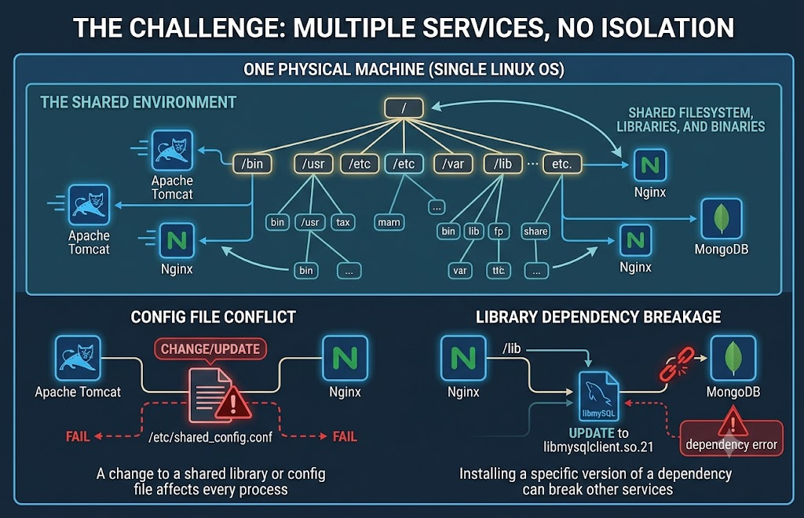
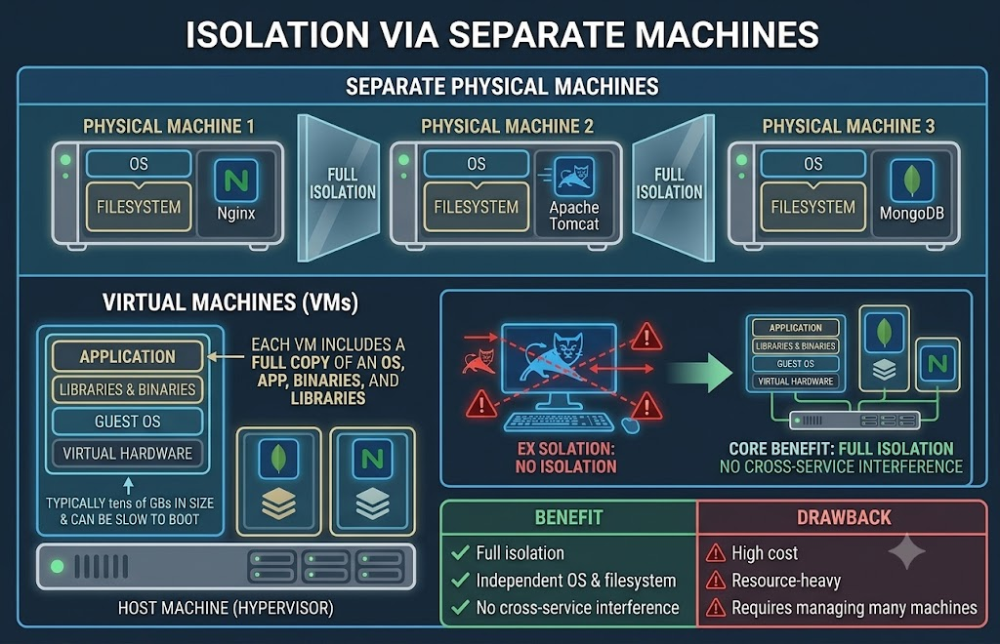
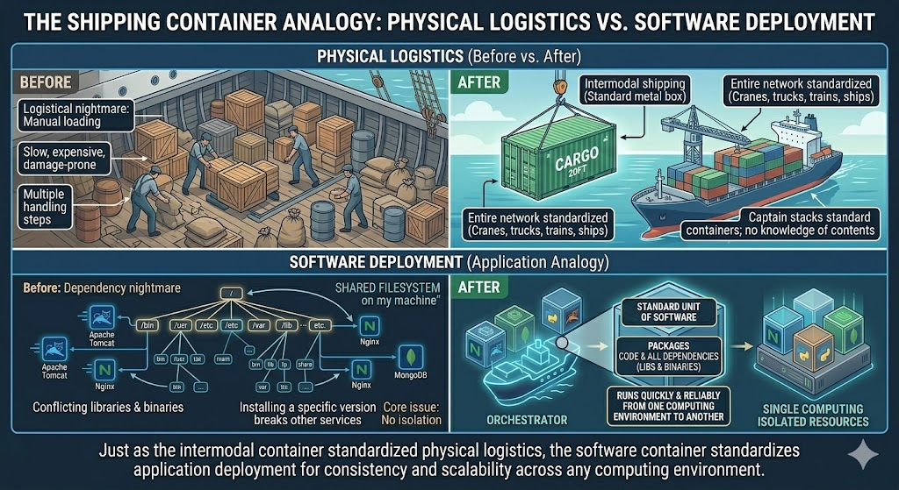
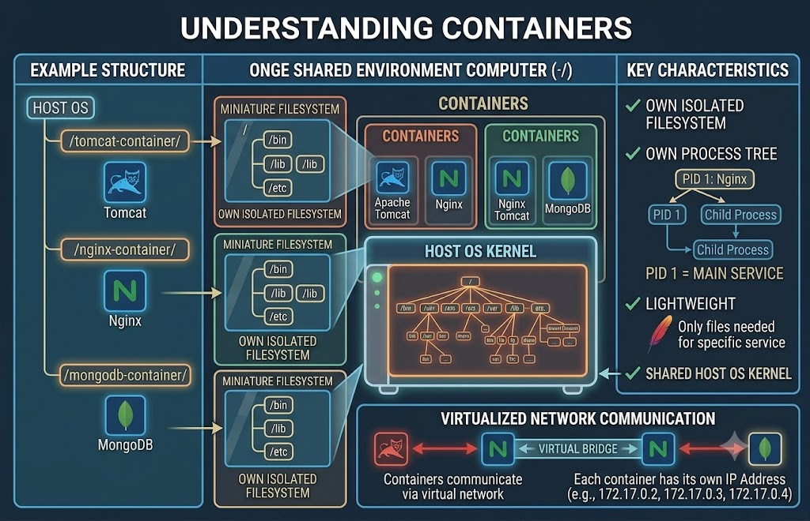
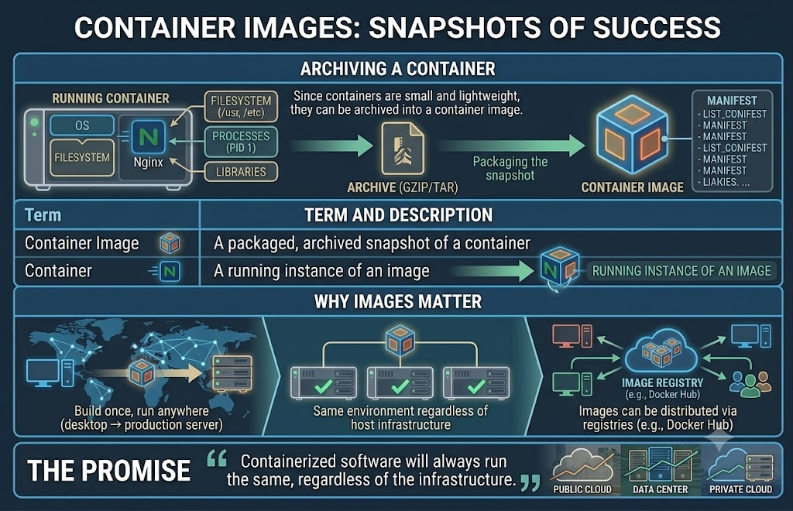
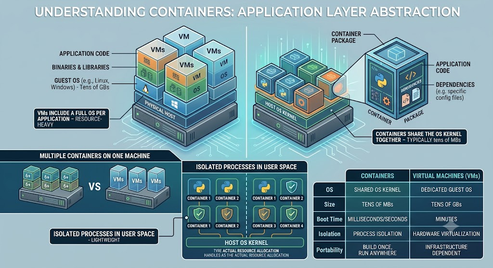
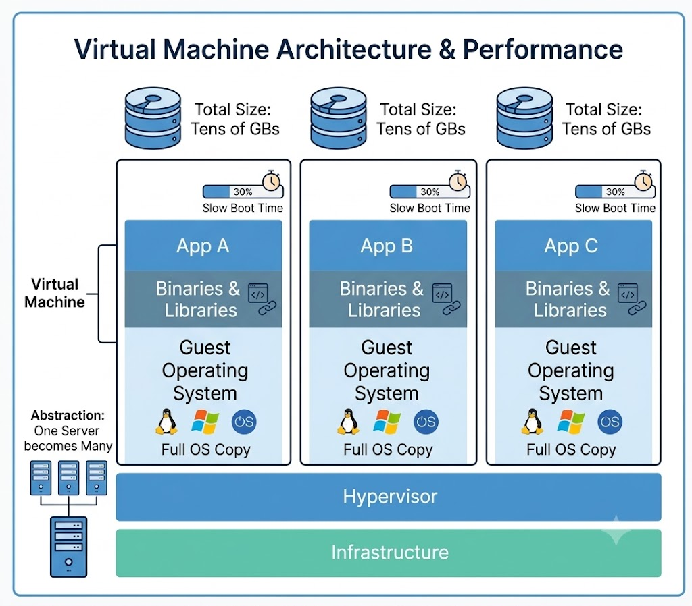
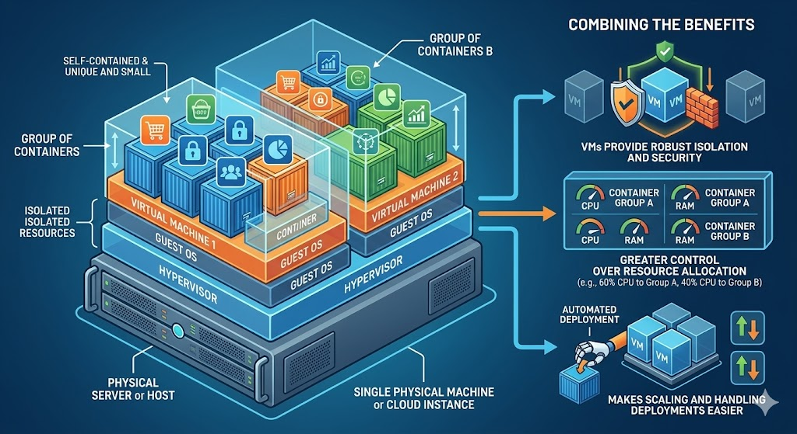
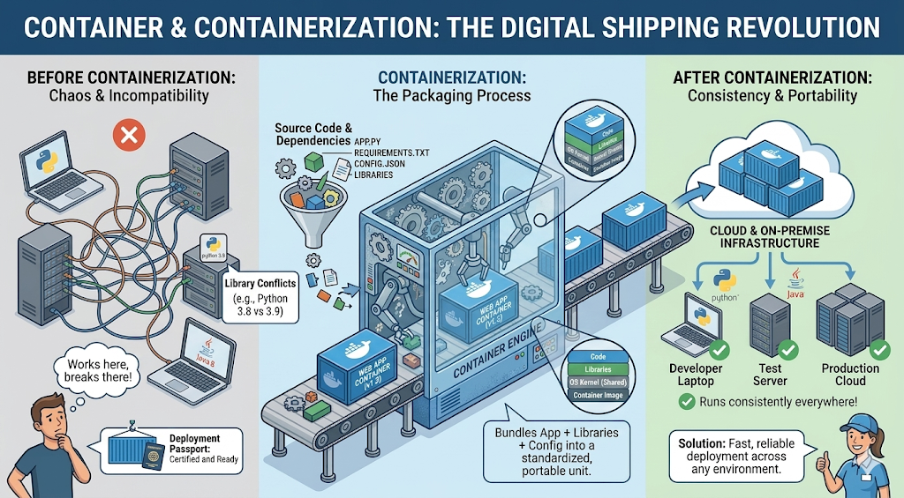
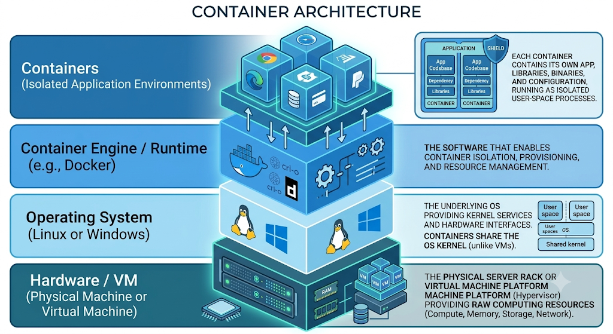

# Introduction to Containers

## 1. The Real-World Problem: "It Works on My Machine"

A developer writes code that runs perfectly on their laptop. They push it to the testing server — and everything breaks. This happens because **environments differ**: a slightly different version of Python, a missing system library, or a config file that doesn't exist on the production server.

Trying to keep every environment perfectly synchronized is an endless, frustrating problem. Containerization was built to solve exactly this.

---

## 2. The Problem: Running Multiple Services on One Machine

A typical Linux computer has a **single filesystem hierarchy** (root `/`, with subdirectories like `/bin`, `/var`, `/etc`, etc.) shared by all running processes.



When multiple services — such as **Apache Tomcat**, **Nginx**, and **MongoDB** — run on the same OS:

- They all share the **same filesystem, libraries, and binaries**
- A change to a shared library or config file **affects every process**
- Installing a specific version of a dependency can **break other services**

> **Core issue:** No isolation between services running on the same machine.

---

## 3. Traditional Solution: Separate Machines

To achieve isolation, services were placed on **separate physical or virtual machines**, each with its own OS.



| Benefit | Drawback |
|---|---|
| Full isolation | High cost |
| Independent OS & filesystem | Resource-heavy |
| No cross-service interference | Requires managing many machines |

Virtual Machines (VMs) include a **full copy of an OS**, application, binaries, and libraries — typically **tens of GBs** in size and can be slow to boot.

---

## 4. What is Containerization?

Containerization is the process of creating containers — it is a form of **operating system virtualization**. An app doesn't just need its own code; it also needs specific libraries (like OpenSSL), interpreters (like Node.js or Python), and environment variables. Containerization bundles application code together with the exact versions of all required libraries and settings into a single **image**. When you run this image, it creates an isolated environment — the container.

The application inside the container thinks it has its own pristine operating system. It cannot see outside its box, and outside applications cannot see in, unless explicitly allowed.

### The Shipping Container Analogy

Before the 1950s, shipping goods overseas was a logistical nightmare — longshoremen manually loaded different-sized items into ships. It was slow, expensive, and items were frequently damaged.

Then came the **intermodal shipping container** — a standard metal box. The entire global logistics network (cranes, trucks, trains, cargo ships) is designed to handle that one standard box size. The ship captain doesn't need to know what's inside; they just stack standard containers.

**A software container does the exact same thing for applications.** It is a standard unit of software that packages up code and all its dependencies so the application runs quickly and reliably from one computing environment to another.



---

## 5. The Better Solution: Containers

A **container** is essentially a **directory** on the host OS that contains its own miniature filesystem — structured like an OS, but lightweight.



### Key Characteristics

- Each container has its **own isolated filesystem**
- Each container has its **own process tree** (PID 1 = the main service, e.g., Nginx)
- Containers are **lightweight** — only includes files needed to run that specific service
- Multiple containers share the **host OS kernel** (no separate OS per container)

### Example

```
Host OS
├── /tomcat-container/   → runs Tomcat  (PID 1 = Tomcat)
├── /nginx-container/    → runs Nginx   (PID 1 = Nginx)
└── /mongodb-container/  → runs MongoDB (PID 1 = MongoDB)
```

Containers communicate via a **virtualized network**, with each container receiving its own IP address.

---

## 6. Container Images



Since containers are small and lightweight, they can be **archived** into a **container image**.

| Term | Description |
|---|---|
| **Container Image** | A packaged, archived snapshot of a container |
| **Container** | A running instance of an image |

### Why Images Matter

- **Portable** — build once, run anywhere (desktop → production server)
- **Consistent** — same environment regardless of host infrastructure
- **Shareable** — images can be distributed via registries (e.g., Docker Hub)

> *"Containerized software will always run the same, regardless of the infrastructure."*

---

## 7. Containers and Virtual Machines

Containers and virtual machines have similar resource isolation and allocation benefits, but function differently because containers virtualize the operating system instead of hardware. Containers are more portable and efficient.

### Containers



Containers are an abstraction at the app layer that packages code and dependencies together. Multiple containers can run on the same machine and share the OS kernel with other containers, each running as isolated processes in user space. Containers take up less space than VMs (container images are typically tens of MBs in size), can handle more applications and require fewer VMs and Operating systems.

### Virtual Machines (VMs)

Virtual machines (VMs) are an abstraction of physical hardware turning one server into many servers. The hypervisor allows multiple VMs to run on a single machine. Each VM includes a full copy of an operating system, the application, necessary binaries and libraries – taking up tens of GBs. VMs can also be slow to boot.



### Containers vs. Virtual Machines

| Feature | Containers | Virtual Machines |
|---|---|---|
| OS | Shares host OS kernel | Full OS per VM |
| Size | Tens of **MBs** | Tens of **GBs** |
| Startup | Very fast | Slow to boot |
| Isolation | Process-level | Hardware-level |
| Efficiency | High | Lower |
| Portability | High | Moderate |

> Containers and VMs can also be **used together** for flexibility — containers running inside VMs is a common production pattern.

### Containers and Virtual Machines Together

Containers and VMs used together provide a great deal of flexibility in deploying and managing applications. For example, you can run containers inside VMs to combine the benefits of both technologies:



- **VMs** provide robust isolation and security, reducing risk to the overall application
- **Containers** inside VMs allow greater control over resource allocation, ensuring each group of containers has sufficient resources
- This combination makes **scaling and handling deployments** easier across different environments

### Container Standards and Industry Leadership



The launch of Docker in 2013 jump-started a revolution in application development by democratizing software containers. Docker developed a Linux container technology — one that is portable, flexible, and easy to deploy. Docker open-sourced libcontainer and partnered with a worldwide community of contributors to further its development. In June 2015, Docker donated the container image specification and runtime code, now known as **runc**, to the Open Container Initiative (OCI) to help establish standardization as the container ecosystem grows and matures.

Following this evolution, Docker continues to give back with the **containerd** project, which Docker donated to the Cloud Native Computing Foundation (CNCF) in 2017. containerd is an industry-standard container runtime that leverages runc and was created with an emphasis on simplicity, robustness, and portability. containerd is the core container runtime of the Docker Engine.

---

## 8. When to Use Each Technology

### Use Virtual Machines when…

| Use Case | Why VMs? |
|---|---|
| **Legacy applications** | VMs can run outdated or older OS environments that modern systems don't support |
| **Multi-OS environments** | Run Linux, Windows, etc. on the same physical hardware simultaneously |
| **Security-critical workloads** | Complete isolation means a breach in one VM cannot affect others |

> Containers **cannot** run different operating systems on the same host — they share the host kernel. VMs are the only option for true multi-OS setups.

### Use Containers when…

| Use Case | Why Containers? |
|---|---|
| **Microservices architecture** | Each microservice (auth, storage, etc.) runs in its own container independently |
| **CI/CD & DevOps pipelines** | Fast startup and low overhead enable rapid testing, integration, and deployment |
| **Portability across environments** | Move seamlessly from dev → staging → production without compatibility issues |
| **Cloud-native applications** | Platform-agnostic design fits perfectly in cloud and hybrid environments |

---

## 9. Key Benefits of Containerization

| Benefit | Description |
|---|---|
| **Consistency (Portability)** | If it runs on a developer's laptop, it runs exactly the same in production, on AWS, Azure, or bare-metal. Truly "write once, run anywhere." |
| **Efficiency & Density** | No full OS per app means far more applications per physical server — significant cost savings on hardware and cloud bills. |
| **Speed** | Containers start and stop in seconds or milliseconds, enabling rapid deployment, auto-scaling during traffic spikes, and instant scale-down. |
| **DevOps & Microservices** | Ideal for microservices architecture and CI/CD pipelines — automated systems can easily build, test, and discard disposable containers. |

---

## 10. Container Architecture



- **Hardware** — physical machine or virtual machine
- **Operating System** — Linux or Windows
- **Container Engine / Runtime** — software that enables container isolation (most famous: **Docker**)
- **Containers** — isolated application environments

---

## 11. The Ecosystem: Docker and Kubernetes

**Docker** is the most widely used container runtime environment (also called a *container engine*). For most people, "Docker" is synonymous with containers.

- Launched in **2013** as open source
- Built on Linux primitives: **cgroups** (resource limits) and **namespaces** (isolation)
- Later extended to **Windows Server** via a Microsoft partnership
- Docker created the **industry standard** for portable containers

### Docker's Core Contributions

| Project | Contribution |
|---|---|
| **libcontainer** | Open-sourced Linux container technology |
| **runc** | Donated to Open Container Initiative (OCI) in 2015 — standardizes container image specs & runtime |
| **containerd** | Donated to CNCF in 2017 — industry-standard container runtime at the core of Docker Engine |

### Kubernetes (K8s)

Once you have hundreds or thousands of containers running across many different servers, managing them manually becomes impossible. **Kubernetes** is a container **orchestration** platform — like the conductor of an orchestra — that:

- Manages **where containers run** across a cluster of servers
- Automatically **restarts containers** if they crash
- Ensures containers can **communicate** with each other
- Handles **scaling** up and down based on demand

---

## 12. Summary

| Concept | Key Takeaway |
|---|---|
| **The core problem** | Environments differ between machines; containers eliminate the "works on my machine" issue |
| **What is containerization?** | Bundling app code + all dependencies into a portable, isolated image |
| **What is a container?** | A lightweight, isolated environment with its own filesystem & process tree |
| **What is an image?** | An archived, portable snapshot of a container |
| **Containers vs VMs** | Containers are lighter, faster, and more portable; VMs offer stronger hardware-level isolation |
| **What is Docker?** | The leading container engine that popularized containerization |
| **What is Kubernetes?** | An orchestration platform for managing containers at scale |

---

*Further study: Docker in depth, Kubernetes for container orchestration.*