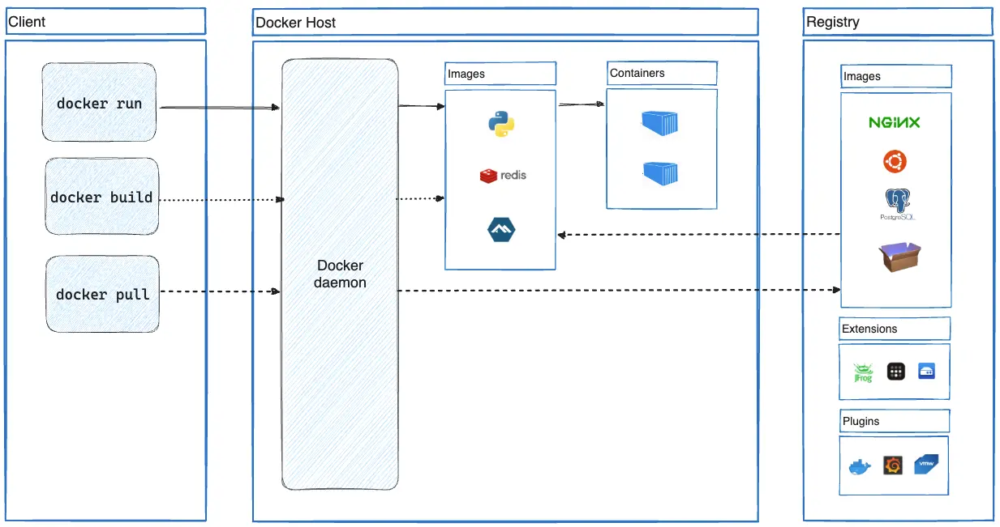

# Docker Overview

## 1. What is Docker?

Docker is an **open platform** for developing, shipping, and running applications. It enables you to **separate your applications from your infrastructure** so you can deliver software quickly.

> By taking advantage of Docker's methodologies for shipping, testing, and deploying code, you can significantly reduce the delay between writing code and running it in production.

In practical terms:
- **Developing** → build your own container image with your application inside
- **Shipping** → archive and distribute that image to any environment
- **Running** → execute the container anywhere Docker is installed

---

## 2. The Docker Platform

Docker provides the ability to package and run an application in a loosely isolated environment called a **container**. The isolation and security allow you to run **many containers simultaneously on a single host** — no need for multiple computers just for isolation.

Docker manages the **full lifecycle** of your containers:

1. Develop your application and its supporting components using containers
2. The container becomes the unit for **distributing and testing** your application
3. Deploy into your production environment as a container or an orchestrated service — whether that's a local data center, a cloud provider, or a hybrid of the two

---

## 3. What Can I Use Docker For?

### Fast, Consistent Delivery

Docker streamlines the development lifecycle by letting developers work in **standardized environments** using local containers. A typical CI/CD workflow looks like:

1. Developers write code locally and **share work via Docker containers**
2. The app is pushed to a **test environment** for automated and manual testing
3. Bugs are fixed in development and **redeployed** to the test environment for validation
4. When testing is complete, the fix reaches the customer by **pushing the updated image to production**

### Responsive Deployment and Scaling

Docker containers can run on:
- A developer's local laptop
- Physical or virtual machines in a data center
- Cloud providers
- A mixture of environments

Docker's portability and lightweight nature make it easy to **dynamically scale** — spinning up or tearing down applications in near real time as business needs dictate.

### Running More Workloads on the Same Hardware

Docker is lightweight and fast — a cost-effective alternative to hypervisor-based VMs. You can use more of your server capacity to achieve business goals. Docker is ideal for **high-density environments** and small-to-medium deployments where you need to do more with fewer resources.

---

## 4. Docker Architecture

Docker uses a **client-server architecture**.



### The Docker Daemon (`dockerd`)

The Docker daemon **listens for Docker API requests** and manages Docker objects — images, containers, networks, and volumes. A daemon can also communicate with other daemons to manage Docker services.

### The Docker Client (`docker`)

The Docker client is the **primary way users interact with Docker**. When you run commands like `docker run`, the client sends these to `dockerd`, which carries them out. The client can communicate with more than one daemon.

### Docker Desktop

Docker Desktop is an easy-to-install application for **Mac, Windows, or Linux** that enables you to build and share containerized applications. It bundles together:

- Docker Daemon (`dockerd`)
- Docker Client (`docker`)
- Docker Compose
- Docker Content Trust
- Kubernetes
- Credential Helper

### Docker Registries

A **Docker registry** stores Docker images. **Docker Hub** is the default public registry — anyone can use it. You can also run your own private registry.

| Command | Action |
|---|---|
| `docker pull` | Downloads an image from the registry |
| `docker run` | Pulls image (if not local) and runs a container |
| `docker push` | Uploads your image to the registry |

> **hub.docker.com** hosts thousands of ready-made official images: Python, PostgreSQL, Ubuntu, Redis, Node, MongoDB, MySQL, Nginx, Golang, and many more. You can also create and store your own images there.

---

## 5. Docker Objects

### Images

An image is a **read-only template** with instructions for creating a Docker container. Images are often built on top of other images with added customization — for example, starting from an Ubuntu base image and adding Apache and your application on top.

To build your own image, you write a **Dockerfile** — a simple file defining each step needed to create the image. Key properties:

- Each instruction in a Dockerfile creates a **layer** in the image
- When you rebuild, only **changed layers** are rebuilt — keeping images small and fast
- Images are **read-only**; a container adds a writable layer on top at runtime

### Containers

A container is a **runnable instance of an image**. Using the Docker API or CLI, you can:

- Create, start, stop, move, or delete a container
- Connect it to one or more networks
- Attach storage to it
- Create a new image based on its current state

> When a container is removed, any changes to its state that aren't stored in persistent storage are lost.

---

## 6. Example: Running a Container

```bash
docker run -i -t ubuntu /bin/bash
```

What happens step by step:

1. **Pull** — if the `ubuntu` image isn't local, Docker pulls it from Docker Hub
2. **Create** — Docker creates a new container from the image
3. **Filesystem** — Docker allocates a read-write filesystem layer to the container
4. **Network** — Docker creates a network interface and assigns the container an IP address
5. **Run** — Docker starts the container and executes `/bin/bash`
6. **Interactive** — the `-i` and `-t` flags attach your terminal so you can type commands
7. **Stop** — when you run `exit`, the container stops but is not removed; you can restart or delete it

---

## 7. The Three Core Docker Commands

| Command | Purpose |
|---|---|
| `docker build` | Build your own image from a Dockerfile |
| `docker pull` | Download an existing image from a registry (e.g., Docker Hub) |
| `docker run` | Run a container from an image |

---

## 8. Underlying Technology

Docker is written in the **Go programming language** and leverages Linux kernel features to deliver containerization.

The core mechanism is **namespaces** — Docker creates a set of namespaces for each container, providing an isolated workspace. Each aspect of a container runs in a separate namespace and its access is limited to that namespace.

| Linux Feature | Role in Docker |
|---|---|
| **Namespaces** | Provides isolation — each container gets its own isolated view of the system |
| **cgroups** | Controls and limits resource usage (CPU, memory) per container |

---

## 9. Summary

| Concept | Description |
|---|---|
| **Docker** | Open platform for developing, shipping, and running containerized apps |
| **Docker Daemon** | The background service (`dockerd`) that manages containers, images, networks, and volumes |
| **Docker Client** | The CLI tool (`docker`) used to send commands to the daemon |
| **Docker Desktop** | All-in-one GUI app for Mac/Windows/Linux that bundles the full Docker toolkit |
| **Registry / Docker Hub** | Storage for container images; Docker Hub hosts thousands of official images |
| **Image** | A read-only, layered template used to create containers |
| **Container** | A running instance of an image — isolated, lightweight, and portable |
| **Dockerfile** | A script defining how to build a custom image layer by layer |
| **Namespaces** | Linux kernel feature providing isolation for each container |

---

*Next: Hands-on Docker — building images, running containers, and working with Docker Hub.*
