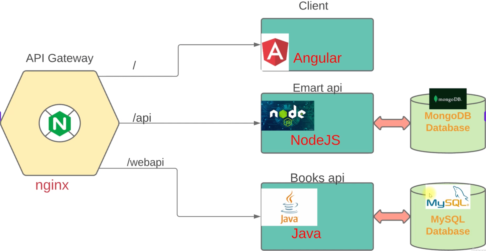

# Deploying a Microservices Application 

## Overview

This section demonstrates deploying a real microservices application called **EMart** — an e-commerce platform similar to Amazon or Flipkart. Unlike vProfile (which is a monolithic Java application), EMart is built using microservices architecture with multiple independent services written in different languages, each running in its own Docker container.

This is a practical example of everything covered in the Monolithic vs Microservices section: multiple services, multiple languages, an API Gateway, and containers providing the isolation each service needs.

---

## EMart Architecture

EMart consists of six services, all running as Docker containers and communicating through an Nginx API Gateway:



### Services Breakdown

| Container | Technology | Port | Role |
|-----------|-----------|------|------|
| `nginx` | Nginx | 80 | API Gateway — routes traffic to the correct service based on URL path |
| `client` | Angular | 4200 | Frontend UI — the user-facing web application |
| `api` | Node.js | 5000 | Mart API — handles product data and user operations; uses MongoDB |
| `webapi` | Java | 9000 | Books API — handles books section of the store; uses MySQL |
| `emongo` | MongoDB 4 | 27017 | Database for the Node.js Mart API |
| `emartdb` | MySQL 8.0.33 | 3306 | Database for the Java Books API |

### URL Routing via Nginx

| URL Path | Routed To | Service |
|----------|-----------|---------|
| `/` (root) | Angular client | Frontend application |
| `/api` | Node.js API | Mart API (products, users) |
| `/webapi` | Java API | Books API |

This is the API Gateway pattern in practice — the Nginx container is the single entry point; users and the frontend never interact with the backend services directly.

---

## The Vagrantfile

The VM for this project runs Ubuntu Focal and automatically installs Docker and Docker Compose during provisioning:

```ruby
Vagrant.configure("2") do |config|
  config.vm.box = "ubuntu/focal64"

  config.vm.network "private_network", ip: "192.168.56.82"
  config.vm.network "public_network"

  config.vm.provider "virtualbox" do |vb|
    vb.memory = "2048"
  end

  config.vm.provision "shell", inline: <<-SHELL
    sudo apt-get update
    sudo apt-get install ca-certificates curl gnupg -y

    sudo install -m 0755 -d /etc/apt/keyrings
    curl -fsSL https://download.docker.com/linux/ubuntu/gpg | sudo gpg --dearmor -o /etc/apt/keyrings/docker.gpg
    sudo chmod a+r /etc/apt/keyrings/docker.gpg

    echo \
      "deb [arch="$(dpkg --print-architecture)" signed-by=/etc/apt/keyrings/docker.gpg] https://download.docker.com/linux/ubuntu \
      "$(. /etc/os-release && echo "$VERSION_CODENAME")" stable" | \
      sudo tee /etc/apt/sources.list.d/docker.list > /dev/null

    sudo apt-get update
    sudo apt-get install docker-ce docker-ce-cli containerd.io docker-buildx-plugin docker-compose-plugin -y
  SHELL
end
```

**Key VM settings:**

| Setting | Value | Purpose |
|---------|-------|---------|
| Box | `ubuntu/focal64` | Ubuntu 20.04 LTS |
| Private IP | `192.168.56.82` | Access the app at `http://192.168.56.82` |
| Public network | Enabled | Allows internet access for image pulls |
| Memory | 2048 MB | Required — building Node.js images is memory-intensive |
| Provisioner | Shell | Automatically installs Docker CE and Docker Compose plugin on first boot |

---

## The `docker-compose.yaml` File

Source: `https://raw.githubusercontent.com/devopshydclub/emartapp/refs/heads/main/docker-compose.yaml`

```yaml
version: "3.8"

services:
  client:
    build:
      context: ./client
    ports:
      - "4200:4200"
    container_name: client
    depends_on:
      - api
      - webapi

  api:
    build:
      context: ./nodeapi
    ports:
      - "5000:5000"
    restart: always
    container_name: api
    depends_on:
      - nginx
      - emongo

  webapi:
    build:
      context: ./javaapi
    ports:
      - "9000:9000"
    restart: always
    container_name: webapi
    depends_on:
      - emartdb

  nginx:
    restart: always
    image: nginx:latest
    container_name: nginx
    volumes:
      - "./nginx/default.conf:/etc/nginx/conf.d/default.conf"
    ports:
      - "80:80"

  emongo:
    image: mongo:4
    container_name: emongo
    environment:
      - MONGO_INITDB_DATABASE=epoc
    ports:
      - "27017:27017"

  emartdb:
    image: mysql:8.0.33
    container_name: emartdb
    ports:
      - "3306:3306"
    environment:
      - MYSQL_ROOT_PASSWORD=emartdbpass
      - MYSQL_DATABASE=books
```

### Key Differences from vProfile's Docker Compose

In the vProfile project, all images were pulled from Docker Hub (`image: imagename`). In EMart, three services use **`build:`** instead — Docker Compose will **build the image from source code** before running the container:

| Service | How the image is obtained | Why |
|---------|--------------------------|-----|
| `client` | Built from `./client` (Angular source) | Custom application code |
| `api` | Built from `./nodeapi` (Node.js source) | Custom application code |
| `webapi` | Built from `./javaapi` (Java source) | Custom application code |
| `nginx` | Pulled from `nginx:latest` (Docker Hub) | Standard image + custom config via volume mount |
| `emongo` | Pulled from `mongo:4` (Docker Hub) | Standard MongoDB image |
| `emartdb` | Pulled from `mysql:8.0.33` (Docker Hub) | Standard MySQL image |

### `depends_on` Explained

The `depends_on` directive controls **startup order**:

- `client` waits for `api` and `webapi` to start — the frontend needs the backend ready
- `api` waits for `nginx` and `emongo` — Node.js needs the gateway and its database
- `webapi` waits for `emartdb` — Java API needs its MySQL database

### `restart: always`

The `api` and `webapi` services have `restart: always` set. This means Docker will automatically restart these containers if they exit unexpectedly — important for services that depend on databases that may not be fully ready when the container first starts.

### Nginx Volume Mount

```yaml
volumes:
  - "./nginx/default.conf:/etc/nginx/conf.d/default.conf"
```

The Nginx API Gateway configuration is not baked into the image. Instead, the `default.conf` file from the repository is mounted into the container at runtime. This file contains the routing rules that direct `/`, `/api`, and `/webapi` traffic to the correct services.

---

## Setup and Deployment Steps

### 1. Prerequisites — Check Existing VMs

Before bringing up this VM, ensure all other VMs are powered off to avoid resource conflicts:

```bash
vagrant global-status --prune
```

Power off any running VMs:

```bash
vagrant halt
```

### 2. Bring Up the VM

Navigate to the folder containing the Vagrantfile and run:

```bash
vagrant up
```

This boots the Ubuntu VM and automatically installs Docker CE and the Docker Compose plugin. No manual Docker installation is needed.

### 3. Log Into the VM

```bash
vagrant ssh
sudo -i
```

### 4. Clone the EMart Source Code

```bash
git clone https://github.com/devopshydclub/emartapp.git
ls
cd emartapp/
ls
```

You should see the project structure including `docker-compose.yaml`, and subdirectories for `client`, `nodeapi`, `javaapi`, and `nginx`.

### 5. Review the Docker Compose File

```bash
vim docker-compose.yaml
```

Note the `build:` sections for `client`, `api`, and `webapi`. These tell Docker Compose to build images from the local source code directories before running them.

### 6. Build Images and Start All Containers

```bash
docker-compose up -d
```

**What this does:**
1. Builds Docker images for `client` (Angular), `api` (Node.js), and `webapi` (Java) from their respective source directories
2. Pulls pre-built images for `nginx`, `emongo` (MongoDB), and `emartdb` (MySQL) from Docker Hub
3. Creates and starts all six containers in the background (`-d` = detached mode)

> **This will take a significant amount of time** — building Node.js images in particular is slow because npm installs all dependencies during the build. Be patient and let it complete.

If the build fails, you can run the build and start steps separately:

```bash
# Build all images first
docker-compose build

# Then start containers once build is complete
docker-compose up -d
```

### 7. Verify All Containers Are Running

```bash
docker-compose ps
```

You should see six containers all in a running state:

```
Name        Command        State    Ports
------------------------------------------
client      ...            Up       0.0.0.0:4200->4200/tcp
api         ...            Up       0.0.0.0:5000->5000/tcp
webapi      ...            Up       0.0.0.0:9000->9000/tcp
nginx       ...            Up       0.0.0.0:80->80/tcp
emongo      ...            Up       0.0.0.0:27017->27017/tcp
emartdb     ...            Up       0.0.0.0:3306->3306/tcp
```

Also check with:

```bash
docker ps -a
```

If any container shows `Exited`, the `restart: always` policy will attempt to restart it automatically. Wait a moment and check again.

### 8. Get the VM IP Address

```bash
ip addr show
```

The private network IP is `192.168.56.82` (as defined in the Vagrantfile).

---

## Accessing the Application

Open a browser and navigate to:

```
http://192.168.56.82
```

Port 80 is the default for HTTP so you do not need to specify it explicitly.

### Validating the Stack

**Frontend (Angular + Nginx):**
The EMart homepage loads — confirms Nginx is routing correctly and the Angular client is served.

**Node.js API + MongoDB:**
Click **Register** and create a new user account (enter email, password, ID number, first name, and city). User data is written to MongoDB via the Node.js API.

After registering, log in. A successful login confirms:
- Angular frontend is communicating with the Node.js API
- Node.js API is connected to MongoDB
- User data was correctly stored and retrieved

**Java API + MySQL:**
Navigate to the **Booksmart** section of the application. This section is served by the Java `webapi` service connected to the MySQL `emartdb` database. Products loading in this section confirm the Java API and MySQL connection are working.

---

## Cleanup

When finished, tear down all containers and free up disk space:

```bash
# Make sure you are in the emartapp directory
cd ~/emartapp

# Stop and remove all containers defined in the compose file
docker-compose down

# Remove all unused containers, images, networks, and build cache
docker system prune -a
```

Then stop the VM:

```bash
exit
vagrant halt
```

---

## Summary of Commands

```bash
# 1. Check and clean up existing VMs
vagrant global-status --prune

# 2. Bring up the Docker VM
vagrant up

# 3. SSH in and switch to root
vagrant ssh
sudo -i

# 4. Clone the EMart source code
git clone https://github.com/devopshydclub/emartapp.git
cd emartapp/

# 5. Review the compose file
vim docker-compose.yaml

# 6. Build images and start all containers
docker-compose up -d

# (Alternative if step 6 fails)
docker-compose build
docker-compose up -d

# 7. Verify containers
docker-compose ps
docker ps -a

# 8. Get VM IP
ip addr show

# 9. Access in browser: http://192.168.56.82

# 10. Cleanup
docker-compose down
docker system prune -a
exit
vagrant halt
```

---

## vProfile vs EMart — Comparison

| Aspect | vProfile | EMart |
|--------|---------|-------|
| Architecture | Monolithic | Microservices |
| Languages | Java only | Angular, Node.js, Java |
| Deployment | Manual (Part 1) / Vagrant automated (Part 2) | Docker Compose |
| Images | Pre-built, pulled from Docker Hub | Built from source + pulled from Docker Hub |
| Entry point | Nginx (reverse proxy to Tomcat) | Nginx (API Gateway routing multiple services) |
| Databases | MySQL + Memcached | MongoDB (Node.js) + MySQL (Java) |
| Containers | 5 containers | 6 containers |
| Build step | Maven build inside VM | `docker-compose build` (builds inside containers) |
| `depends_on` | Not used | Used to control startup order |

---