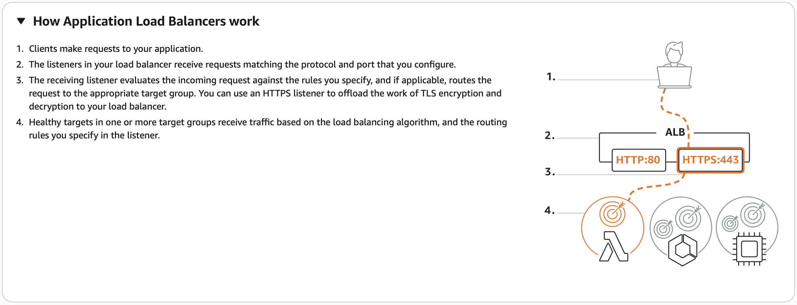
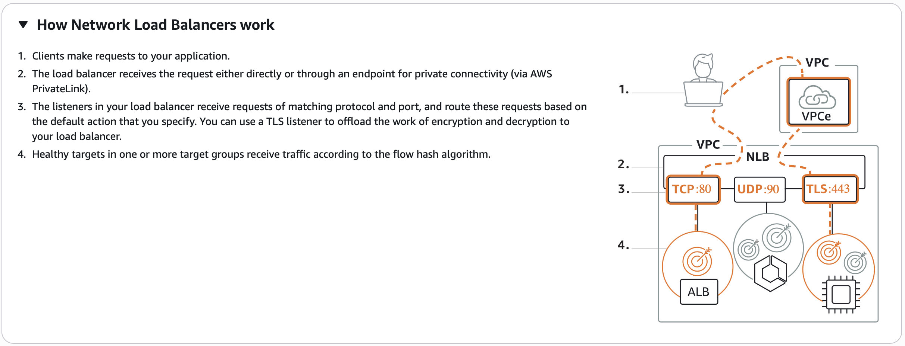
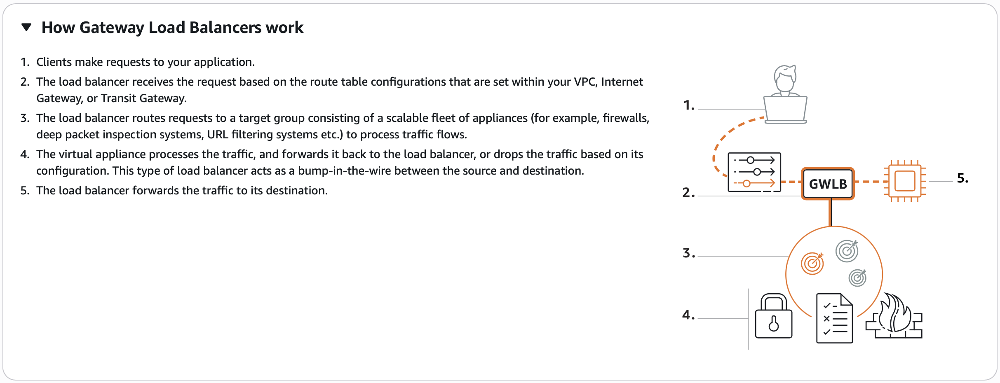

# AWS Load Balancers 

---

## 1. Why Do We Need Load Balancers?

In real-world production environments, a **single web server is never enough**:

| Problem | Solution |
|---|---|
| One server can't handle all traffic | Distribute load across multiple servers |
| A single server going down = downtime | Multiple servers provide high availability |
| Peak traffic causes performance issues | Scale out (add servers) when needed |
| Maintenance requires downtime | Update servers one at a time with no disruption |

When you have a **cluster of web servers**, you need a **single endpoint** for users to access — that is exactly what a load balancer provides.

### What a Load Balancer Does

```
User Request
     ↓
Load Balancer (Single Endpoint)
     ├── → Web Server 1 (Port 80)
     ├── → Web Server 2 (Port 80)
     └── → Web Server 3 (Port 80)
```

> A load balancer is a **proxy** — it receives traffic on a **frontend port** and distributes it to backend servers. It is NOT the real server.

### Benefits

- **Balances load** → better performance across all servers
- **Scale out / Scale in** → add or remove servers without user disruption
- **High availability** → if one server fails, others continue serving traffic
- **Maintenance-friendly** → deregister a server, update it, re-register it — zero downtime
- **Single endpoint** → users always access the same URL/IP regardless of how many backend servers exist

---

## 2. AWS Elastic Load Balancers (ELB)

> On AWS, you do **not** need to launch an EC2 instance and install load balancer software. AWS provides **managed Elastic Load Balancers (ELB)** as a service.

There are **four types** of AWS load balancers:

| Type | Short Name | OSI Layer | Protocol | Primary Use |
|---|---|---|---|---|
| **Application Load Balancer** | ALB | Layer 7 | HTTP, HTTPS, gRPC | Web apps, APIs, microservices |
| **Network Load Balancer** | NLB | Layer 4 | TCP, UDP, TLS | High performance, static IP |
| **Gateway Load Balancer** | GWLB | Layer 3 | GENEVE | Firewalls, IDS/IPS appliances |
| **Classic Load Balancer** | CLB | Layer 4 | HTTP, HTTPS, TCP | Simple legacy use cases |

---

## 3. Load Balancer Types — Detailed

### 3.1 Application Load Balancer (ALB) — Most Used



> Choose ALB for **HTTP and HTTPS traffic** requiring **intelligent, URL-based routing**.

**Key characteristics:**
- Works at **Layer 7 (Application Layer)** — understands URLs, headers, query strings
- **Content-based routing** — route based on URL path, hostname, HTTP method
- Supports **HTTPS/TLS termination** — offloads encryption work from backend servers
- Ideal for **microservices, containers, web applications, APIs**
- Does NOT provide a static IP — accessed via DNS name
- Most commonly used AWS load balancer — used throughout this course

**When to use:**
- Web applications, websites, REST APIs
- Microservices routing (different paths → different services)
- Any HTTP/HTTPS traffic requiring advanced routing

---

### 3.2 Network Load Balancer (NLB)



> Choose NLB for **ultra-high performance** and when you need a **static IP address**.

**Key characteristics:**
- Works at **Layer 4 (Transport Layer)** — understands IP and port, not URLs
- Handles **millions of requests per second** with ultra-low latency
- Provides **static IP addresses** per Availability Zone — important for firewall whitelisting
- Supports **TCP, UDP, TLS** protocols
- Can be placed **in front of an ALB** for static IP + application routing
- More expensive than ALB
- TLS offloading at scale, centralized certificate deployment

**When to use:**
- Gaming, financial applications, IoT, real-time services
- When a static IP is required (e.g., partner systems that whitelist your IP)
- When you need millions of requests per second with minimal latency

---

### 3.3 Gateway Load Balancer (GWLB)



> Choose GWLB when you need to deploy and manage a fleet of **third-party virtual appliances** (firewalls, IDS/IPS).

**Key characteristics:**
- Works at **Layer 3 (Network Layer)**
- Uses the **GENEVE protocol** (RFC 8926)
- Acts as a **"bump in the wire"** — forwards packets to security appliances and back
- Preserves **all source and destination IP information** in the packet — required for firewalls and IDS/IPS to scan properly
- Used for: firewalls, deep packet inspection, URL filtering, intrusion detection systems
- Requires understanding of AWS VPC networking
- Out of scope for this course — requires VPC experience

---

### 3.4 Classic Load Balancer (CLB)

> The original ELB — simple, legacy, works on Layer 4.

**Key characteristics:**
- Works on **Layer 4** — forwards by IP and port
- Simple configuration — no target groups needed (add instances directly)
- Does NOT understand URLs — no content-based routing
- Ideal for **simple, straightforward** use cases
- Being phased out — ALB or NLB preferred for new deployments

---

## 4. Load Balancer Type Comparison

| Feature | ALB | NLB | GWLB | CLB |
|---|---|---|---|---|
| **OSI Layer** | 7 | 4 | 3 | 4 |
| **Protocol** | HTTP, HTTPS, gRPC | TCP, UDP, TLS | GENEVE (IP packets) | HTTP, HTTPS, TCP |
| **URL-based routing** | ✅ Yes | ❌ No | ❌ No | ❌ No |
| **Static IP** | ❌ No (DNS only) | ✅ Yes | — | ❌ No |
| **Millions req/sec** | ❌ No | ✅ Yes | — | ❌ No |
| **Target groups** | ✅ Yes | ✅ Yes | ✅ Yes | ❌ No |
| **Target types** | Instances, IP, Lambda, ALB | Instances, IP | Instances, IP | Instances |
| **TLS termination** | ✅ Yes | ✅ Yes | ❌ No | ✅ Yes |
| **Use case** | Web apps, APIs | High perf, static IP | Security appliances | Simple legacy |

### Pricing

| Load Balancer | Hourly Charge | Usage Metric |
|---|---|---|
| **ALB** | ~$0.0225/hr | LCU — connections, active connections, bandwidth |
| **NLB** | ~$0.0225/hr | NLCU — bandwidth and connections |
| **GWLB** | ~$0.0125/hr | GLCU — Gateway LB Capacity Units |
| **CLB** | ~$0.025/hr | Data Transfer (GB) |

---

## 5. Internet-Facing vs. Internal Load Balancers

When you create a load balancer, you must choose its **scheme** — and this **cannot be changed after creation**.

### Internet-Facing Load Balancer

```
Internet Users
     ↓
[Internet-Facing Load Balancer]
  → Public IP addresses on load balancer nodes
  → DNS name resolves to PUBLIC IPs
  → Accessible from the internet
     ↓
EC2 Instances (can use PRIVATE IPs internally)
```

- Load balancer nodes have **public IP addresses**
- DNS name is **publicly resolvable**
- Routes requests from clients **over the internet**
- Requires instances to be in **public subnets**

### Internal Load Balancer

```
Internal App/Service
     ↓
[Internal Load Balancer]
  → Private IP addresses on load balancer nodes
  → DNS name resolves to PRIVATE IPs
  → Only accessible within the VPC
     ↓
Backend EC2 Instances
```

- Load balancer nodes have **only private IP addresses**
- DNS name resolves to **private IPs**
- Only accessible by clients **within the VPC**
- Used for **internal app-to-app communication**

> **Important:** Both Internet-facing and internal load balancers route requests to instances using **private IP addresses**. Your instances **do not need public IP addresses** to receive requests from either type of load balancer.

### Multi-Tier Architecture Using Both Types

A common production architecture uses **both** an internet-facing and an internal load balancer:

```
Internet Users
     ↓
[Internet-Facing ALB]
  → Routes public traffic
     ↓
Web Servers (EC2)
  → Connected to internet via Internet-facing LB
  → Sends database requests to internal LB
     ↓
[Internal ALB]
  → Only accessible within VPC
     ↓
Database Servers (EC2 / RDS)
  → Never exposed to the internet
```

| Tier | Load Balancer Type | Why |
|---|---|---|
| Web tier | Internet-facing | Accepts requests from public users |
| Database / App tier | Internal | Only accessible from web servers — never exposed publicly |

> This architecture is a security best practice — database servers are completely isolated from the internet, only reachable through the internal load balancer from web servers.

---

## 6. Key Concepts

### Target Groups

> A **target group** is a logical group of backend resources with a health check attached. The load balancer routes traffic to the target group — not directly to individual instances.

**Target types:**
- EC2 Instances
- IP Addresses
- Lambda Functions
- Another Application Load Balancer (ALB routing to ALB)

**Why target groups matter:**
- You can **register and deregister** instances from a target group without touching the load balancer
- Enables **rolling maintenance** — deregister → update → re-register, one server at a time
- Each target group has its own **health check configuration**

---

### Health Checks

> The load balancer **periodically checks** the health of each target. It only routes traffic to **healthy instances**.

**How health checks work:**

```
Load Balancer → HTTP GET /health (port 80) → Instance
                    ↓
              Returns HTTP 200? → Healthy ✅
              Returns error / timeout? → Unhealthy ❌
```

**Health check settings:**

| Setting | Description | Recommended |
|---|---|---|
| **Protocol** | HTTP or HTTPS | Match your service protocol |
| **Path** | URL path to check (e.g., `/` or `/health`) | Use root `/` for simple sites |
| **Port** | Port the service runs on | Match your application port |
| **Healthy threshold** | Number of consecutive successes before declaring healthy | 2 (reduced from default 5) |
| **Unhealthy threshold** | Number of consecutive failures before declaring unhealthy | 2 |
| **Timeout** | Seconds to wait for response | 5 seconds |
| **Interval** | Time between health checks | 30 seconds |
| **Success codes** | Expected HTTP status code | 200 |

> **Critical:** Always configure health checks correctly. Misconfigured health checks are a common cause of instances showing as "unhealthy" even when the service is running fine.

---

### Listeners

> A **listener** checks for incoming connection requests on a specific protocol and port. Rules on the listener determine where to route the request.

```
Listener: HTTP:80
  ↓
  Rule 1: /videos → Video Target Group
  Rule 2: /api    → API Target Group
  Default: /      → Web Target Group
```

You can have **multiple listeners** on one load balancer (e.g., port 80 and port 443).

---

## 6. Security Group Architecture for Load Balancers

A critical design principle: **the load balancer and instances have SEPARATE security groups**.

```
Internet (User)
     ↓ Port 80
[Load Balancer Security Group]
  → Inbound: HTTP 80 from 0.0.0.0/0 (anyone)
  → Inbound: HTTPS 443 from 0.0.0.0/0 (anyone)
     ↓ Port 80
[Instance Security Group]
  → Inbound: HTTP 80 from [Load Balancer SG] ← key rule
  → Inbound: SSH 22 from My IP
```

> **The instance security group should allow port 80 ONLY from the Load Balancer Security Group** — not from `0.0.0.0/0`. This ensures traffic can only reach the instances through the load balancer.

### Common Mistake — Instances Show as Unhealthy

```
Problem: Load balancer says instances are "unhealthy"
         but you can access them directly via public IP

Cause:   Instance security group only allows port 80 from "My IP"
         The load balancer's IP is different — it's blocked

Fix:     Edit instance security group inbound rules:
         → Remove: HTTP 80 from My IP
         → Add:    HTTP 80 from [Load Balancer Security Group ID]
```

---

## 7. Hands-On Lab — Setting Up an Application Load Balancer

### Prerequisites
- Two EC2 instances (web01, web02) with Apache running
- Apache serving a website from `/var/www/html/`
- Website accessible on port 80

### Step 1 — Prepare Web Servers (Using Launch Template or Manual)

```
Launch two EC2 instances:
  Name: web01, web02
  AMI: Ubuntu Server 24.04 LTS
  Type: t2.micro
  Security Group: project-dev-web (SSH port 22 only for now)
  Apache + website deployed on both
```

---

### Step 2 — Create Target Group

```
EC2 → Load Balancing → Target Groups → Create Target Group

Settings:
  Target type:     Instances
  Protocol:        HTTP
  Port:            80

Health check:
  Protocol:        HTTP
  Path:            /
  Port:            Traffic port (80)
  Healthy threshold:   2 (reduced from 5 — faster detection)
  Unhealthy threshold: 2
  Timeout:         5 seconds
  Interval:        30 seconds
  Success codes:   200

Name: inner-peace-TG

Register targets:
  → Select web01 and web02
  → Click "Include as pending below"
  → Confirm both appear in the review
  → Create Target Group
```

---

### Step 3 — Create Load Balancer Security Group

```
EC2 → Security Groups → Create Security Group

Name: inner-peace-elb-SG
Description: Load balancer security group

Inbound rules:
  HTTP  | TCP | Port 80  | 0.0.0.0/0  (anyone can access)
  HTTP  | TCP | Port 80  | ::/0       (IPv6)
  HTTPS | TCP | Port 443 | 0.0.0.0/0 — (add in production)

Outbound rules:
  Leave as default (All traffic allowed out)

→ Create Security Group
```

---

### Step 4 — Create Application Load Balancer

```
EC2 → Load Balancing → Load Balancers → Create Load Balancer
→ Select: Application Load Balancer → Create

Basic configuration:
  Name:    inner-peace-ALB
  Scheme:  Internet-facing  (public users access this)
  IP type: IPv4

Network mapping:
  VPC:   Default VPC
  Zones: Select ALL availability zones
         (instances will be distributed across them)

Security group:
  → Remove "default" security group
  → Select: inner-peace-elb-SG

Listeners and routing:
  Listener: HTTP:80
  Default action: Forward to → inner-peace-TG (target group)

→ Create Load Balancer
→ Wait for status: provisioning → active
```

---

### Step 5 — Update Instance Security Group

After creating the load balancer, update the **instance** security group to allow traffic from the load balancer:

```
EC2 → Security Groups → Select instance security group (project-dev-web)
→ Edit Inbound Rules

Remove:
  HTTP | TCP | 80 | My IP

Add:
  HTTP | TCP | 80 | Source: [inner-peace-elb-SG security group ID]
  Description: "Allow from load balancer"

→ Save Rules
```

---

### Step 6 — Verify Health Checks

```
EC2 → Load Balancing → Target Groups → inner-peace-TG → Targets

Watch instances:
  initial: unhealthy
  after 2 health checks (2 × 30s = ~1 minute): healthy ✅

Both instances healthy → load balancer starts routing traffic
```

---

### Step 7 — Test the Load Balancer

```
EC2 → Load Balancers → inner-peace-ALB → Description tab
→ Copy the DNS name (e.g., inner-peace-ALB-123456.us-east-1.elb.amazonaws.com)
→ Open in browser: http://inner-peace-ALB-123456.us-east-1.elb.amazonaws.com

If website loads → load balancer is working ✅
Traffic is being distributed between web01 and web02
```

---

## 8. Application Load Balancer — Configuration Options

| Setting | Options | Notes |
|---|---|---|
| **Scheme** | Internet-facing / Internal | Internet-facing = public users; Internal = private app-to-app |
| **IP type** | IPv4 / Dualstack / Dualstack without public IPv4 | IPv4 for most use cases |
| **Zones** | Select multiple AZs | Always select 2+ for high availability |
| **Listeners** | HTTP:80, HTTPS:443, and others | Add HTTPS with ACM certificate for production |
| **Routing** | Forward / Redirect / Fixed response | Forward to target group for normal operation |
| **Stickiness** | On/Off | Binds user session to specific target |

### Optional Integrations

| Integration | Benefit |
|---|---|
| **Amazon CloudFront + AWS WAF** | Edge acceleration + application security (DDoS, XSS, etc.) |
| **AWS WAF alone** | Application-layer firewall — blocks attacks before reaching instances |
| **AWS Global Accelerator** | Two static global IPs + multi-region failover |

> **AWS WAF** is different from security groups — it works at the application level, blocking DDoS, cross-site scripting, specific IP ranges, geographic restrictions, and many other threats.

---

## 9. AMI — Amazon Machine Image

Once a web server is set up and working, you can create an **AMI** from it to quickly launch identical servers later.

### What is an AMI?
> An AMI is a **snapshot/template of an EC2 instance** — contains the OS, installed software, configurations, and data at the time the image was created.

### Why Create an AMI?

> If web02 needs to be identical to web01 (same OS, Apache config, website files), **don't build it from scratch** — create an AMI from web01 and launch web02 from that image.

```
web01 (fully configured with Apache + website)
     ↓  Create AMI
web01-AMI
     ↓  Launch from AMI
web02 (identical to web01) ← no reinstallation needed
web03 (identical to web01) ← no reinstallation needed
```

### Creating an AMI — Step by Step

```
EC2 → Instances → Select web01
→ Actions → Image and Templates → Create Image

Settings:
  Image name:        Web01-AMI-2026-06-11
  Description:       AMI after deploying web application
  Reboot instance:   ✅ Enabled (ensures filesystem consistency)

Volumes:
  /dev/xvda → Create new snapshot from volume (automatic)

Tags:
  Name: Web01-AMI
  Environment: Production
  Project: Website

→ Create Image
```

> **Reboot instance:** Keep this checked — it ensures the filesystem is in a consistent state when snapshots are taken. Deselect only if you require zero downtime and accept consistency risks.

**AWS automatically:**
1. Reboots the instance (if reboot enabled)
2. Creates an EBS snapshot of all attached volumes
3. Registers the AMI

### Monitor AMI Creation

```
EC2 → Images → AMIs → (filter: Owned by me)
Status: pending → available ✅
(takes a few minutes)
```

### Launch New Instance from AMI

```
EC2 → Launch Instance → My AMIs → Select your AMI
→ Follow wizard:
    - Instance type: t2.micro
    - Key pair: select existing
    - Security group: select existing
    - Tag: Name = web02
→ Launch Instance
```

The new instance (web02) will have the **exact same** OS, packages, Apache config, and website files as web01 — immediately ready to serve traffic without any reinstallation.

### AMI and Snapshot Relationship

When you create an AMI, AWS creates an **EBS snapshot** linked to it:

```
AMI (Web01-AMI)
  └── Snapshot (auto-created, tied to AMI)
       └── OS + software + data at creation time
```

> You **cannot delete the snapshot** while the AMI still exists.
> **Cleanup order:** Deregister AMI first → then delete the snapshot.

---

## 10. Website Deployment Script (Bash)

For automating web server setup on both CentOS/Amazon Linux and Ubuntu:

```bash
#!/bin/bash

URL='https://www.tooplate.com/zip-templates/2098_health.zip'
ART_NAME='2098_health'
TEMPDIR="/tmp/webfiles"

# Detect OS
yum --help &> /dev/null

if [ $? -eq 0 ]; then
    # CentOS / Amazon Linux
    PACKAGE="httpd wget unzip"
    SVC="httpd"
    echo "Running Setup on CentOS/Amazon Linux"
    sudo yum install $PACKAGE -y > /dev/null
else
    # Ubuntu / Debian
    PACKAGE="apache2 wget unzip"
    SVC="apache2"
    echo "Running Setup on Ubuntu"
    sudo apt update
    sudo apt install $PACKAGE -y > /dev/null
fi

# Start and enable service
sudo systemctl start $SVC
sudo systemctl enable $SVC

# Download and deploy website
mkdir -p $TEMPDIR
cd $TEMPDIR
wget -q $URL || { echo "Download failed!"; exit 1; }
unzip $ART_NAME.zip > /dev/null
sudo cp -r $ART_NAME/* /var/www/html/

# Restart service
sudo systemctl restart $SVC

# Cleanup
rm -rf $TEMPDIR

# Verify
sudo systemctl is-active $SVC
ls /var/www/html/
```

**Key improvements over basic version:**
- `wget -q $URL || exit 1` — fails fast if download fails
- `systemctl is-active` instead of full status output
- `sudo` on all commands — safe to run as non-root

---

## 11. Cleanup

After completing the load balancer lab:

```
Step 1: Delete Load Balancer
  Load Balancers → Select → Actions → Delete

Step 2: Delete Target Group
  Target Groups → Select → Actions → Delete

Step 3: Terminate EC2 Instances
  Instances → Select web01 + web02 → Instance State → Terminate

Step 4: Verify EC2 Dashboard
  ✅ 0 Running instances
  ✅ 0 Load balancers
  ✅ 0 Elastic IPs
  ✅ 0 Volumes

Step 5: Keep AMI for future use
  Keep the AMI you created — it will be used in upcoming lectures
  Do NOT delete the snapshot tied to the AMI
  (To delete later: Deregister AMI first, then delete snapshot)
```

---

## 12. Summary

```
AWS Load Balancers (ELB)
│
├── Why needed
│   ├── Single endpoint for clusters of servers
│   ├── Distribute traffic → better performance
│   ├── High availability → redundancy
│   └── Zero-downtime maintenance
│
├── Types
│   ├── ALB (Layer 7) → HTTP/HTTPS, URL routing, most used
│   ├── NLB (Layer 4) → TCP/UDP, static IP, millions req/sec
│   ├── GWLB (Layer 3) → GENEVE, firewalls/IDS, VPC required
│   └── CLB (Layer 4) → simple, legacy, no target groups
│
├── Scheme (set at creation — cannot change)
│   ├── Internet-facing → public IPs, accessible from internet
│   │   └── Instances don't need public IPs (LB uses private IPs internally)
│   ├── Internal → private IPs only, VPC-accessible only
│   └── Multi-tier architecture → use both:
│       Internet-facing LB → Web servers → Internal LB → DB servers
│
├── Core Components
│   ├── Listeners → check requests on a port/protocol
│   ├── Target Groups → logical group of instances + health check
│   └── Health Checks → detect and route only to healthy instances
│
├── Security Group Architecture
│   ├── LB SG → allows 80/443 from 0.0.0.0/0
│   └── Instance SG → allows 80 ONLY from LB Security Group
│
├── Lab Flow
│   ├── Launch 2 web servers (web01, web02)
│   ├── Create Target Group (HTTP:80, health check /)
│   ├── Create LB Security Group (port 80 from anywhere)
│   ├── Create ALB (internet-facing, all AZs)
│   ├── Update instance SG (allow port 80 from LB SG)
│   ├── Wait for health checks to pass (2 × 30s)
│   └── Test via ALB DNS name in browser
│
├── AMI
│   ├── Create from web01 → snapshot of OS + software + data
│   ├── Launch web02 from AMI → identical server, no reinstall
│   ├── Deregister AMI first → then delete snapshot (cleanup order)
│   └── Keep AMI for upcoming lectures
│
└── Cleanup Order
    Delete LB → Delete TG → Terminate instances → Keep AMI
    (Deregister AMI → Delete snapshot when fully done)
```

---

*Sources: DevOps Course — VisualPath by Imran Teli; AWS ELB Documentation (aws.amazon.com/elasticloadbalancing)*